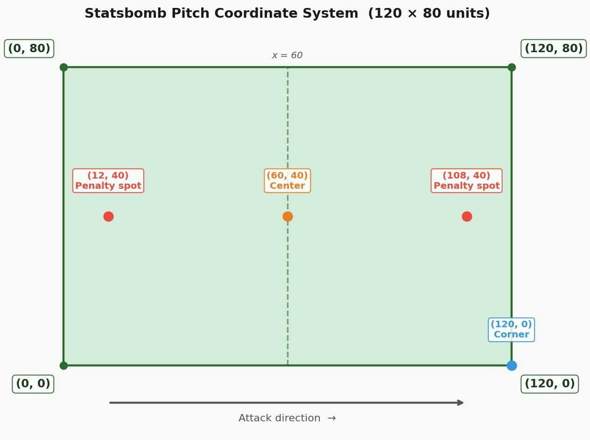
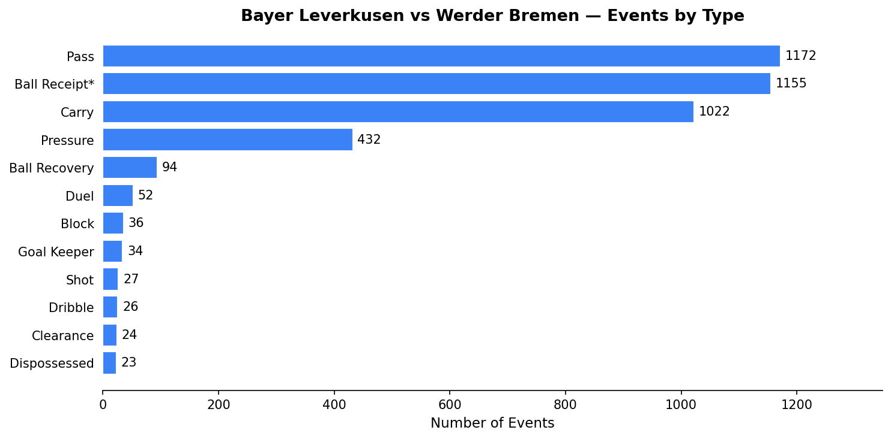
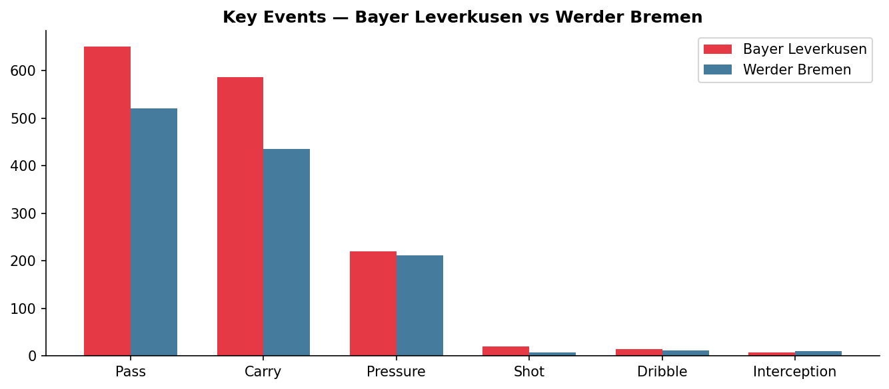
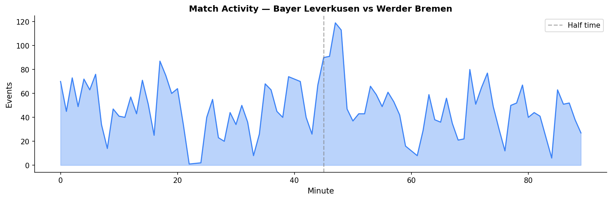
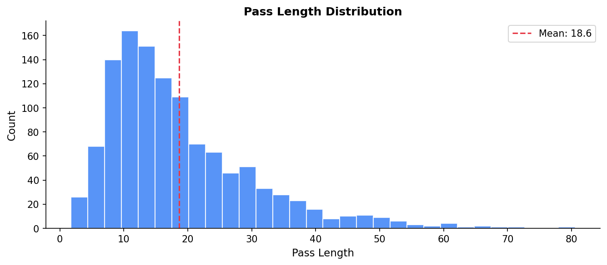

# Football Analytics Explained: The Data Behind Every Touch
Every time a player touches the ball, something gets recorded. A pass, a shot, a carry. Each one becomes a data point. A single 90-minute match produces over 3,000 of them.

That data is what football analytics runs on. In this series, we're going to use it to build real analyses from scratch in Python.

This first article is about understanding what the data actually looks like. No visualizations yet. Just you, a JSON file, and a lot of football events.

---

## Where Does the Data Come From?

The data we're using comes from **Statsbomb**, one of the leading data providers in professional football. They offer a free, open dataset covering hundreds of matches across major competitions. La Liga, the Champions League, the Women's World Cup, Euro 2024 and more.

You can find it on their [GitHub page](https://github.com/statsbomb/open-data). In total, the open dataset contains:
• **3,464 matches** across 75 competition seasons
• **9.8 GB** of event data
• **360° tracking data** for selected competitions (more on that in a later article)

We downloaded everything locally so the notebooks run fast. The data structure is exactly the same as what you'd get from the API.

---

## Setup

We're using a small helper module that handles all the file loading. You'll find it in the `assets/helpers/` folder of this repo.

```python
import sys
import json
import pandas as pd
import matplotlib.pyplot as plt

sys.path.append('/path/to/Blog/assets/helpers')
from data_loader import load_competitions, load_matches, load_events, flatten_events
```

---

## Step 1: What Competitions Are Available?

Everything starts with one file. `competitions.json` is a simple list of every competition and season in the dataset.

```python
comp_df = load_competitions()
print(f'Total competition/season combinations: {len(comp_df)}')
```

```
Total competition/season combinations: 75
```

You'll see La Liga with 18 seasons (the richest dataset by far), the Women's World Cup, the Bundesliga, and more. Each row is one competition and season combination, with a `competition_id` and `season_id` you use to load the actual matches.

The dataset covers both men's and women's football:

```python
comp_df['competition_gender'].value_counts()
```

```
male      56
female    19
```

---

## Step 2: Pick a Match

For this article we're using a Bundesliga 2023/24 match. **Bayer Leverkusen 5-0 Werder Bremen**. Good choice for two reasons: the season includes full 360° tracking data, and Leverkusen's unbeaten run makes for great analysis material later in this series.

First, load all matches for the season:

```python
row = comp_df[
    (comp_df['competition_name'] == '1. Bundesliga') &
    (comp_df['season_name'] == '2023/2024')
].iloc[0]

matches = load_matches(row['competition_id'], row['season_id'])
print(f'Matches in season: {len(matches)}')
```

```
Matches in season: 34
```

Then pick the specific match:

```python
MATCH_ID = 3895302

match_row = matches[matches['match_id'] == MATCH_ID].iloc[0]
home_team = match_row['home_team']['home_team_name']
away_team = match_row['away_team']['away_team_name']

print(f'{home_team} {match_row["home_score"]}-{match_row["away_score"]} {away_team}')
```

```
Bayer Leverkusen 5-0 Werder Bremen
```

---

## Step 3: Look at the Raw JSON

Each match has its own events file. Let's load it and look at the raw structure before we touch anything.

```python
raw = load_events(MATCH_ID)
print(f'Total events: {len(raw)}')
```

```
Total events: 4223
```

Over four thousand events in one match. The first one is always a Starting XI entry with the lineups. Here's what a pass event looks like:

```json
{
  "type": { "name": "Pass" },
  "minute": 4,
  "second": 32,
  "team": { "name": "Bayer Leverkusen" },
  "player": { "name": "Granit Xhaka" },
  "location": [45.2, 38.7],
  "pass": {
    "length": 18.3,
    "angle": 0.44,
    "recipient": { "name": "Florian Wirtz" },
    "height": { "name": "Ground Pass" },
    "outcome": null
  }
}
```

Three things to notice:

• Every event has a **type**. Pass, Shot, Carry, Pressure and so on.
• **Location** is always `[x, y]` on a 120x80 pitch. More on that below.
• Type-specific details live in a nested sub-dictionary. Passes have length, angle, recipient. Shots have xG. Carries have an end location.

The `outcome` being null for a pass means it was successful. An intercepted pass would say `"Incomplete"`.

---

## The Coordinate System

Before going further, you need to know how the pitch coordinates work. They show up in every single analysis.

Statsbomb uses a **120 x 80** unit pitch. The origin `(0, 0)` is the bottom-left corner.



The halfway line runs at `x = 60`. A shot from the penalty spot sits at `(108, 40)`. A corner from the right side is at `(120, 0)`.

This is consistent across every match in the dataset. Once you know it, every chart you build makes immediate sense.

---

## Step 4: Flatten Into a DataFrame

The raw JSON is deeply nested. Great for storage, not great for analysis. We flatten it so each event becomes one row in a DataFrame, with type-specific sub-fields as columns.

```python
df = flatten_events(raw)
print(f'Shape: {df.shape}')
```

```
Shape: (4223, 57)
```

The core columns are the same for every event:

```python
core = ['index', 'period', 'minute', 'second', 'type', 'team', 'player', 'x', 'y']
df[core].head(10)
```

| index | period | minute | second | type | team | player | x | y |
|---|---|---|---|---|---|---|---|---|
| 1 | 1 | 0 | 0 | Starting XI | Bayer Leverkusen | NaN | NaN | NaN |
| 2 | 1 | 0 | 0 | Starting XI | Werder Bremen | NaN | NaN | NaN |
| 3 | 1 | 0 | 0 | Half Start | NaN | NaN | NaN | NaN |
| 4 | 1 | 0 | 7 | Pass | Bayer Leverkusen | Granit Xhaka | 61.0 | 40.1 |

Starting XI events have no location because they're just metadata. Almost everything after kickoff has `x` and `y` coordinates.

---

## Step 5: What Event Types Are in This Match?

Now we can start asking real questions. What actually happened?

```python
event_counts = df['type'].value_counts().reset_index()
event_counts.columns = ['Event Type', 'Count']
```

| Event Type | Count |
|---|---|
| Pass | 1172 |
| Ball Receipt | 1155 |
| Carry | 1022 |
| Pressure | 432 |
| Ball Recovery | 94 |
| Duel | 52 |
| Block | 36 |
| Goal Keeper | 34 |
| Shot | 27 |
| Dribble | 26 |

Passes, ball receipts, and carries dominate. That's just football. A pass creates a corresponding ball receipt when successful. Carries fill the time in between. Shots are rare: 27 in a 5-0 match is actually a lot.

Let's plot the top 12:

```python
top = event_counts.head(12)
fig, ax = plt.subplots(figsize=(10, 5))
ax.barh(top['Event Type'][::-1], top['Count'][::-1], color='#3b82f6')
ax.set_title(f'{home_team} vs {away_team} — Events by Type', fontweight='bold')
plt.tight_layout()
```



---

## Step 6: Split by Team

Most event types can be split by team. That's where it gets interesting.

```python
by_team = (
    df.groupby(['type', 'team'])
    .size()
    .reset_index(name='count')
    .pivot(index='type', columns='team', values='count')
    .fillna(0).astype(int)
    .sort_values(home_team, ascending=False)
)
```



Leverkusen had more passes, more pressure events, more shots. Werder barely touched the ball. The data reflects exactly what a 5-0 scoreline looks like from the inside.

---

## Step 7: Simple Queries

With a clean DataFrame, questions become one-liners.

**Who made the most passes?**

```python
passes = df[df['type'] == 'Pass']
passes.groupby(['player', 'team']).size().reset_index(name='passes').sort_values('passes', ascending=False).head(5)
```

| player | team | passes |
|---|---|---|
| Granit Xhaka | Bayer Leverkusen | 87 |
| Jonathan Tah | Bayer Leverkusen | 73 |
| Edmond Tapsoba | Bayer Leverkusen | 61 |
| Amos Pieper | Werder Bremen | 45 |
| Mitchell Weiser | Werder Bremen | 42 |

Xhaka at the base of Leverkusen's midfield. Exactly what you'd expect.

**xG vs actual goals by team:**

```python
shots = df[df['type'] == 'Shot']
xg = shots.groupby('team')['shot_statsbomb_xg'].sum().round(2)
goals = shots[shots['shot_outcome'] == 'Goal'].groupby('team').size()

pd.DataFrame({'xG': xg, 'Goals': goals}).fillna(0)
```

| team | xG | Goals |
|---|---|---|
| Bayer Leverkusen | 3.21 | 5 |
| Werder Bremen | 0.44 | 0 |

Leverkusen scored 5 from chances worth 3.21 xG. Clinical finishing or a good day in front of goal. Spoiler: across the full season, it's both.

**Match activity over time:**

```python
events_per_min = df.groupby('minute').size()
ax.fill_between(events_per_min.index, events_per_min.values, alpha=0.35, color='#3b82f6')
ax.axvline(45, color='gray', linestyle='--', label='Half time')
```



The half-time break is clearly visible. The second-half spike is Bremen pushing forward while already five down.

---

## Step 8: What's Inside a Pass?

Passes are the richest event type with around 20 sub-fields. Let's see what's available:

```python
pass_cols = sorted(c for c in df.columns if c.startswith('pass_'))
for c in pass_cols:
    non_null = df[c].notna().sum()
    print(f'{c:<40} {non_null:>5} non-null')
```

```
pass_aerial_won                              2 non-null
pass_angle                                1172 non-null
pass_body_part                            1172 non-null
pass_cross                                  28 non-null
pass_end_location                         1172 non-null
pass_goal_assist                             5 non-null
pass_height                               1172 non-null
pass_length                               1172 non-null
pass_outcome                               133 non-null
pass_recipient                            1039 non-null
pass_shot_assist                            10 non-null
pass_through_ball                           15 non-null
...
```

One thing that trips everyone up: `pass_outcome` only has a value for **failed** passes. A null outcome means the pass was completed. Keep that in mind whenever you're filtering.

Pass length gives a quick read on a team's style:

```python
ax.hist(passes['pass_length'].dropna(), bins=30, color='#3b82f6')
ax.axvline(passes['pass_length'].mean(), color='#e63946', linestyle='--')
```



Most passes are short. Under 20 units. The long tail covers switches of play and long balls. We'll dig properly into pass types in Article 1.4 when we build pass networks.

---

## What We've Covered

• **Data structure** — competitions > matches > events, all stored as JSON
• **Event types** — ~30 types per match, Pass and Carry make up ~60%
• **Coordinate system** — 120x80 pitch, (0,0) is bottom-left
• **Flattening** — one row per event, nested fields become columns
• **Pass outcome** — null means successful, a value means it failed
• **xG** — lives in `shot_statsbomb_xg` on Shot events

Everything we build from here uses exactly this structure. Shot maps, pass networks, pressing analyses. Once you get it, the rest follows naturally.

---

## What's Next?

In **Article 1.2** we take the `x` and `y` coordinates we just found and put them on an actual pitch. We'll build a football pitch in Python from scratch using matplotlib. It's the visual foundation for every chart in this series.

[Article 1.2: Drawing a Football Pitch in Python](../1.2_Pitch_in_Python/article.md)

---

*Part of **Football Analytics with Python** — a series that takes you from raw Statsbomb data to real tactical analyses.*

*Series: **1.1 The Data** · [1.2 Drawing a Pitch](../1.2_Pitch_in_Python/article.md) · [1.3 Shot Maps](../1.3_Shot_Maps/article.md) · [1.4 Pass Networks](../1.4_Pass_Netzwerke/article.md) · [1.5 Heatmaps](../1.5_Heatmaps/article.md)*

*Data: [Statsbomb Open Data](https://github.com/statsbomb/open-data) · Code: [notebook.ipynb](notebook.ipynb)*
