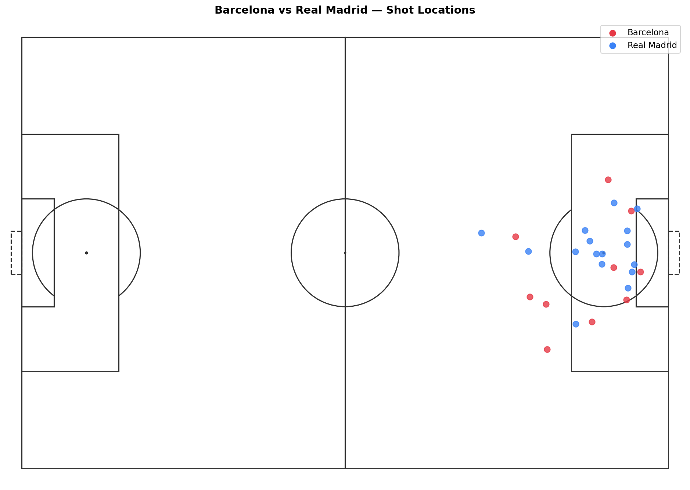
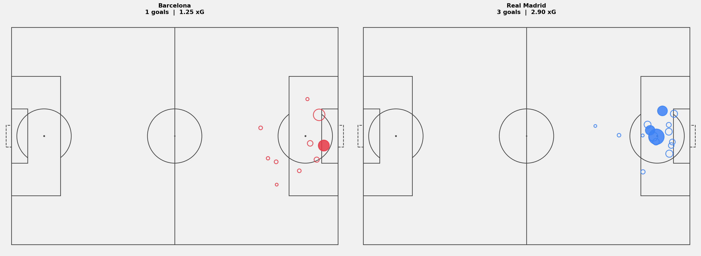

# Shot Maps: Where Does a Team Actually Shoot From?

A final score tells you what happened. A shot map tells you why.

In this article we build a shot map for the 2020/21 El Clásico — Barcelona 1-3 Real Madrid. We plot every shot by location, weight each one by its xG value, and color it by outcome. By the end you have a visualization that explains the match better than the scoreline.

---

## Setup

```python
import sys
import pandas as pd
import matplotlib.pyplot as plt

sys.path.append('/path/to/Blog/assets/helpers')
from data_loader import load_competitions, load_matches, load_events, flatten_events
from pitch import draw_pitch
```

---

## Load the Match

```python
MATCH_ID = 3773585

comp_df = load_competitions()
row = comp_df[
    (comp_df['competition_name'] == 'La Liga') &
    (comp_df['season_name'] == '2020/2021')
].iloc[0]

matches = load_matches(row['competition_id'], row['season_id'])
match_row = matches[matches['match_id'] == MATCH_ID].iloc[0]

home_team = match_row['home_team']['home_team_name']
away_team = match_row['away_team']['away_team_name']

print(f'{home_team} {match_row["home_score"]}-{match_row["away_score"]} {away_team}')
```

```
Barcelona 1-3 Real Madrid
```

El Clásico. Good choice for a shot map: two attacking teams, a result that goes against the hosts, and enough shots on both sides to make the visualization interesting.

---

## Extract the Shots

```python
raw = load_events(MATCH_ID)
df = flatten_events(raw)

shots = df[df['type'] == 'Shot'].copy()
print(f'Total shots: {len(shots)}')
shots[['team', 'player', 'x', 'y', 'shot_statsbomb_xg', 'shot_outcome']].head(6)
```

```
Total shots: 24
```

Each shot row has:
• `x`, `y` — where on the pitch the shot was taken from
• `shot_statsbomb_xg` — the expected goals value for that shot
• `shot_outcome` — Goal, Saved, Blocked, Off T, or Wayward

---

## What Is xG?

xG stands for expected goals. It's a number between 0 and 1 that tells you how likely a shot was to result in a goal, based on similar shots in historical data.

A shot from directly in front of goal from 10 meters out might have xG = 0.45. A long-range header might be 0.02.

The model considers:
• Distance from goal
• Angle to goal
• Body part used (foot vs. header)
• How the chance was created (open play, corner, direct free kick)

xG doesn't tell you whether a shot went in. It tells you how likely it was to. A goalkeeper making a great save doesn't change the xG of that shot. That's the point — it removes luck from the equation.

---

## Step 1: Raw Shot Locations

Start simple. Every shot as a dot on the pitch.

```python
fig, ax = plt.subplots(figsize=(14, 9))
draw_pitch(ax, color='white', line_color='#333333')

for _, shot in shots.iterrows():
    color = '#e63946' if shot['team'] == home_team else '#3b82f6'
    ax.scatter(shot['x'], shot['y'], color=color, s=60, zorder=5, alpha=0.8)

ax.scatter([], [], color='#e63946', s=60, label=home_team)
ax.scatter([], [], color='#3b82f6', s=60, label=away_team)
ax.legend(loc='upper right', fontsize=11)

ax.set_title(f'{home_team} vs {away_team} — Shot Locations', fontweight='bold', fontsize=14, pad=10)
plt.tight_layout()
plt.savefig('figures/shots_raw.png', dpi=150, bbox_inches='tight')
plt.show()
```



You can see where both teams shot from. But all dots look the same — no information about quality or outcome.

---

## Step 2: Add xG and Outcome

Two visual layers:
• Dot size scales with xG. Bigger = better chance.
• Filled dot = goal. Open circle = no goal.

```python
fig, ax = plt.subplots(figsize=(14, 9))
draw_pitch(ax, color='white', line_color='#333333')

for _, shot in shots.iterrows():
    color = '#e63946' if shot['team'] == home_team else '#3b82f6'
    size = max(shot['shot_statsbomb_xg'] * 1500, 40)
    is_goal = shot['shot_outcome'] == 'Goal'

    ax.scatter(shot['x'], shot['y'],
               s=size,
               color=color if is_goal else 'none',
               edgecolors=color,
               linewidths=1.8,
               zorder=5, alpha=0.85)

ax.set_title(f'{home_team} vs {away_team} — Shots with xG', fontweight='bold', fontsize=14, pad=10)
plt.tight_layout()
plt.savefig('figures/shots_xg.png', dpi=150, bbox_inches='tight')
plt.show()
```

Now you can read the match in one glance. Big open circles are dangerous chances that didn't go in. Small filled circles are goals from tight situations.

---

## Step 3: Side by Side, Normalized Direction

The most useful format is two panels — one per team — with both attacking in the same direction. That way you're comparing like with like.

To normalize: if a shot's x coordinate is below 60, the player was shooting at the left goal. We flip it — `x_new = 120 - x`, `y_new = 80 - y` — so it appears on the right half of the pitch.

```python
def normalize_direction(x, y):
    if x < 60:
        return 120 - x, 80 - y
    return x, y

shots[['x_norm', 'y_norm']] = shots.apply(
    lambda r: pd.Series(normalize_direction(r['x'], r['y'])), axis=1
)
```

```python
fig, axes = plt.subplots(1, 2, figsize=(22, 8))
fig.patch.set_facecolor('#f0f0f0')

for ax, team, color in zip(axes, [home_team, away_team], ['#e63946', '#3b82f6']):
    draw_pitch(ax, color='white', line_color='#444444')
    team_shots = shots[shots['team'] == team]

    for _, shot in team_shots.iterrows():
        size = max(shot['shot_statsbomb_xg'] * 1500, 40)
        is_goal = shot['shot_outcome'] == 'Goal'
        ax.scatter(shot['x_norm'], shot['y_norm'],
                   s=size,
                   color=color if is_goal else 'none',
                   edgecolors=color,
                   linewidths=1.8, zorder=5, alpha=0.85)

    total_xg = team_shots['shot_statsbomb_xg'].sum()
    goals = (team_shots['shot_outcome'] == 'Goal').sum()
    ax.set_title(f'{team}\n{goals} goals  |  {total_xg:.2f} xG',
                 fontweight='bold', fontsize=13, pad=12)

plt.tight_layout(pad=2)
plt.savefig('figures/shot_map_both.png', dpi=150, bbox_inches='tight')
plt.show()
```



---

## Reading the Map

A few things to look for:

• **Cluster near the 6-yard box** — a team creating chances from close range, where conversion rates are highest.
• **Shots from wide angles** — speculative or forced efforts. Low xG even when close to goal.
• **Big open circles** — dangerous chances that didn't go in. A team that "deserved more."
• **Small filled circles** — goals from tight situations. Clinical finishing or good fortune.

In this El Clásico, Real Madrid's total xG was lower than Barcelona's. They scored three. Barcelona had the better individual chances but couldn't convert. The map shows that Real Madrid were clinical; the scoreline slightly flattered them based on the underlying quality of chances.

That gap between xG and actual goals is exactly what the next series article on xG digs into properly.

---

## What's Next?

We can see where shots come from. In **Article 1.4** we look at how the ball got there — who passed to whom, and what the team's passing structure looked like across the pitch.

[Article 1.4: Pass Networks](../1.4_Pass_Netzwerke/article.md)

---

*Part of **Football Analytics with Python** — a series that takes you from raw Statsbomb data to real tactical analyses.*

*Series: [1.1 The Data](../1.1_Event_Data_Einstieg/article.md) · [1.2 Drawing a Pitch](../1.2_Pitch_in_Python/article.md) · **1.3 Shot Maps** · [1.4 Pass Networks](../1.4_Pass_Netzwerke/article.md) · [1.5 Heatmaps](../1.5_Heatmaps/article.md)*

*Data: [Statsbomb Open Data](https://github.com/statsbomb/open-data) · Code: [notebook.ipynb](notebook.ipynb)*
