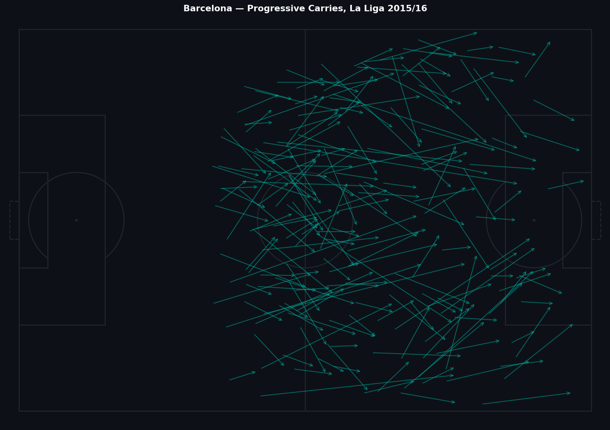
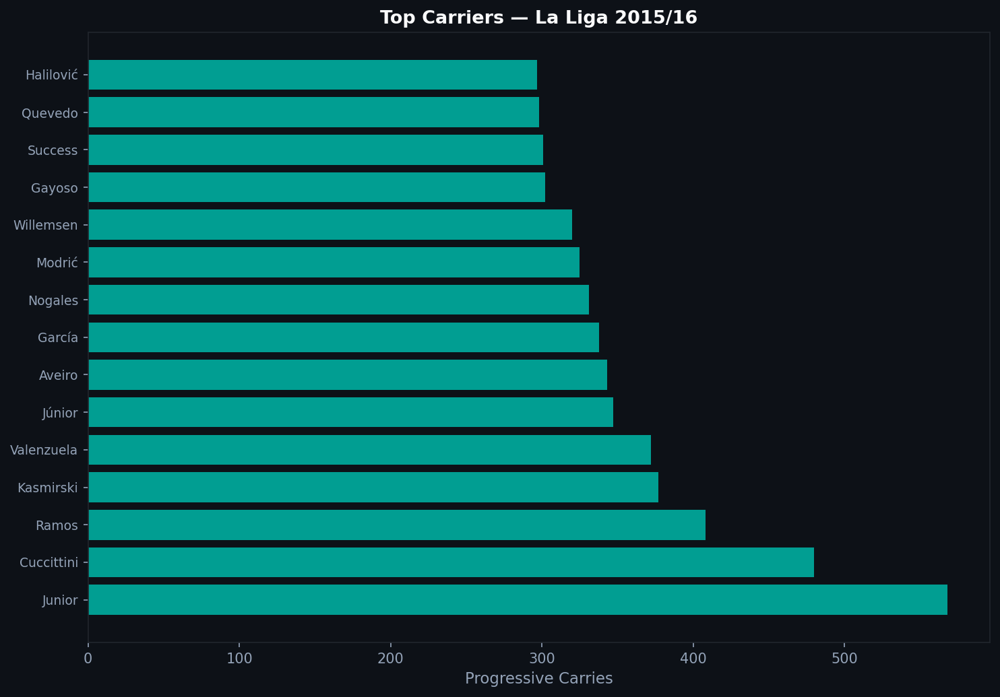
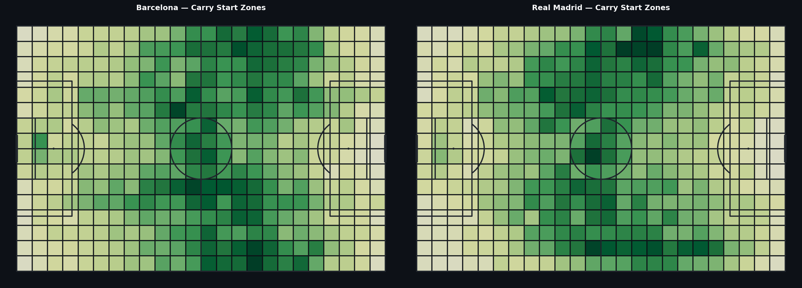

# 2.5 — Carry Data: How Teams Move the Ball Without Passing

Passes and shots get the attention. But carries — sustained ball runs — are how teams bridge space between the zones where passes start and where attacks finish. The data shows who bridges the most, and where.

---

## What a Carry Is

In Statsbomb data, a carry is recorded when a player moves the ball a meaningful distance without it leaving their control. It is distinct from a dribble (which involves an attempt to beat a defender) and from a pass (which transfers the ball to another player).

Each carry has a start location (x, y) and an end location from the `carry_end_location` field.

---

## Progressive Carries

A carry is progressive when it moves the ball forward by more than five yards into the attacking half. This is the carry type that most directly contributes to attacking build-up.



Barcelona's progressive carries in La Liga 2015/16 show a clear pattern: most movement happens in the central and half-space zones between midfield and the penalty area. Wide areas also feature heavily, which reflects the role of fullbacks and wingers in driving forward.

---

## Who Carries the Ball



Messi dominates the progressive carry ranking. This is not a surprise — his hallmark during this era was receiving the ball in midfield, carrying through pressure, and creating or finishing opportunities himself. The carry data makes his role explicit in a way that simpler statistics cannot.

Wide midfielders and fullbacks also feature prominently. Defensive players appear rarely, which reflects both tactical role and data reality: central defenders carry far less because they typically pass rather than run.

---

## Carry Zones: Barcelona vs. Real Madrid



The heatmaps show where each team starts their carries. Barcelona's density is concentrated through the center and half-spaces, consistent with their positional play approach — control the center, create in the pockets. Real Madrid's pattern shows more wide concentration, consistent with their counter-attack and transition-based approach under Zidane.

Neither is better by definition, but the maps make the tactical fingerprint visible.

---

## Implementation

```python
import ast

def parse_loc(s):
    v = ast.literal_eval(s) if isinstance(s, str) else s
    return float(v[0]), float(v[1])

carries_df['carry_end_x'], carries_df['carry_end_y'] = zip(
    *carries_df['carry_end_location'].apply(parse_loc)
)
carries_df['dx'] = carries_df['carry_end_x'] - carries_df['x']
carries_df['progressive'] = (carries_df['dx'] > 5) & (carries_df['x'] > 40)
```

Note that `carry_end_location` is stored as a string in the flattened DataFrame and must be parsed with `ast.literal_eval`.

---

Full notebook: [notebook.ipynb](notebook.ipynb)

*Data: Statsbomb Open Data — La Liga 2015/16, 380 matches.*

---

**Series 2 — Tactical Analysis**

[← 2.4 Freeze Frames](../2.4_Freeze_Frames/article.md) · [2.6 360° Data →](../2.6_360_Daten/article.md)
