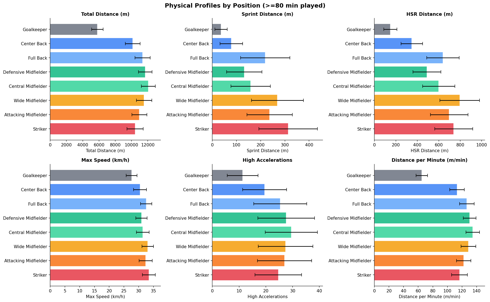
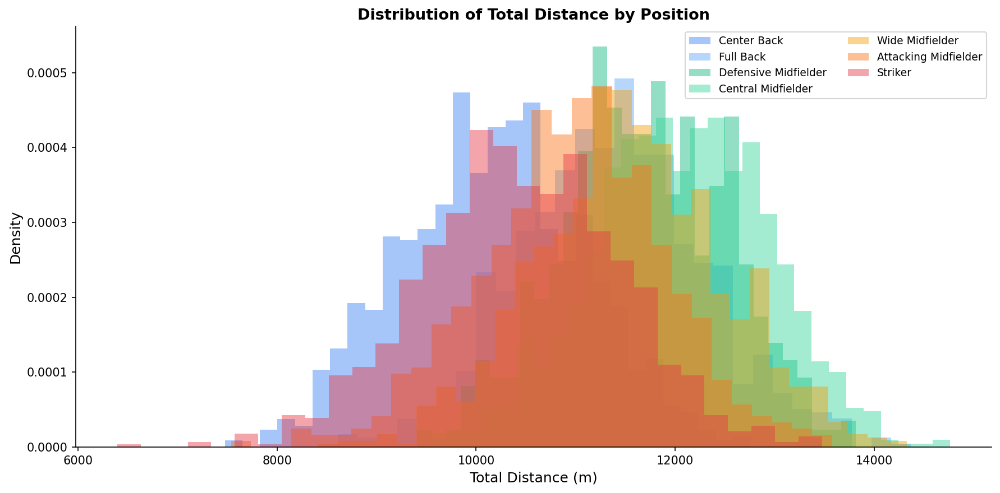
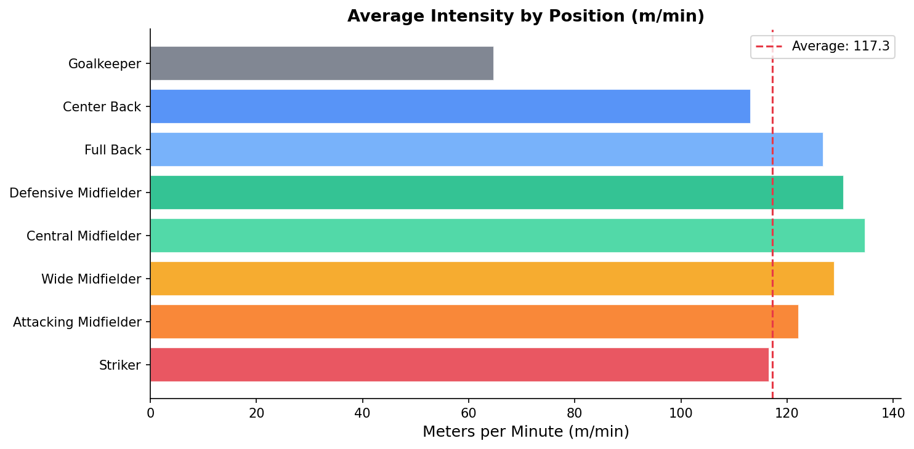

# GPS Tracking in Football: What the Numbers Actually Mean

Every professional player in the top leagues wears a GPS vest during training and matches. The device records their position several times per second. After 90 minutes, you have a detailed physical profile of everything that player did on the pitch.

But the raw GPS trace is not the output. What coaches and analysts actually use are derived metrics: distance covered, speed zones, sprint counts, accelerations. This article explains what each metric measures, why it matters, and where the numbers typically land for different positions.

> **Note on data:** This series uses a synthetic dataset generated from published benchmarks in sports science research. The parameters — distance ranges, speed zone distributions, position profiles — are derived from three peer-reviewed papers: Mohr et al. (2003), Bradley et al. (2009), and Di Salvo et al. (2007). The distributions match what you would see in real professional tracking data, but the individual player records are simulated. Real GPS data is proprietary and not publicly available.
>
> *"Synthetic dataset. Parameters derived from Mohr et al. (2003), Bradley et al. (2009), and Di Salvo et al. (2007). Values are illustrative and should not be cited as empirical measurements."*

---

## Setup

```python
import pandas as pd
import matplotlib.pyplot as plt
import numpy as np

DATA = '../assets/physical_data_synthetic.csv'
df = pd.read_csv(DATA)

print(f'Rows: {len(df)}')
print(f'Matches: {df["match_id"].nunique()}')
print(f'Players: {df["player_id"].nunique()}')
print(f'Teams: {df["team"].nunique()}')
```

```
Rows: 9880
Matches: 380
Players: 280
Teams: 20
```

A full Premier League season. 380 matches, 20 teams, every player who got minutes.

---

## The Metrics, One by One

### Total Distance

The simplest metric: how many meters a player covered in the match. It includes everything — walking, jogging, running, sprinting.

The average outfield player covers 10,000–12,500 meters per game. Goalkeepers cover 5,000–7,000 meters.

Total distance alone is a poor performance indicator. A center-back covering 11km in a deep block is doing something completely different from a central midfielder covering 11km pressing high. The distance is the same. The physical and tactical demands are not.

```python
starters = df[df['minutes_played'] >= 80]

by_position = starters.groupby('position')['total_distance'].agg(['mean', 'std']).round(0)
print(by_position.sort_values('mean', ascending=False))
```

### Speed Zones

GPS systems typically divide speed into zones. The exact thresholds vary between providers, but a common setup:

| Zone | Name | Speed |
|---|---|---|
| 1 | Walking | 0–7 km/h |
| 2 | Jogging | 7–14 km/h |
| 3 | Running | 14–19.8 km/h |
| 4 | High Speed Running (HSR) | 19.8–25.2 km/h |
| 5 | Sprinting | > 25.2 km/h |

In this dataset:
• `running_distance` — Zone 3 (14–19.8 km/h)
• `hsr_distance` — Zone 4 (19.8–25.2 km/h)
• `sprinting_distance` — Zone 5 (> 25.2 km/h)
• `hi_distance` — High Intensity: Zones 4+5 combined

The higher the zone, the more demanding the effort. A player covering 300m at sprint speed is working much harder than a player covering 300m at jogging pace. This is why coaches care more about HSR and sprint distance than total distance.

### Max Speed

The single fastest speed recorded during the match. Measured in km/h.

Elite defenders typically hit 31–34 km/h. Forwards and wingers often reach 34–36 km/h. The world record for a match sprint is around 37 km/h (Kyle Walker, 2023).

Max speed tells you the player's physical ceiling. It's also used for injury risk assessment — a player who suddenly runs significantly below their usual max speed might be carrying a knock.

### Accelerations and Decelerations

Accelerations are counted above a threshold (typically 2.5–3 m/s²). The dataset splits them into medium and high intensity.

Why do accelerations matter more than top speed for fitness load?

Accelerating and decelerating is metabolically expensive. A player who sprints 20m from standing and stops hard uses significantly more energy than a player who maintains a constant high speed for 20m. This is why a center-forward who makes sharp runs into the box — even if they don't cover huge distances — can be one of the most physically loaded players on the pitch.

Count high acceleration correlates strongly with what sports scientists call "neuromuscular load" — the stress placed on muscles, tendons, and the nervous system. This is the metric most associated with injury risk.

---

## Position Profiles

Let me visualize the metrics by position using only players who played at least 80 minutes (to get comparable full-game values).

```python
fig, axes = plt.subplots(2, 3, figsize=(16, 10))
fig.suptitle('Physical Profiles by Position (≥80 min played)', fontweight='bold', fontsize=14)

metrics = [
    ('total_distance',        'Total Distance (m)'),
    ('sprinting_distance',    'Sprint Distance (m)'),
    ('hsr_distance',          'HSR Distance (m)'),
    ('max_speed',             'Max Speed (km/h)'),
    ('count_high_acceleration','High Accelerations'),
    ('mmin',                  'Distance per Minute (m/min)'),
]

pos_order = [
    'Goalkeeper', 'Center Back', 'Full Back',
    'Defensive Midfielder', 'Central Midfielder',
    'Wide Midfielder', 'Attacking Midfielder', 'Striker'
]
colors = ['#6b7280','#3b82f6','#60a5fa','#10b981','#34d399','#f59e0b','#f97316','#e63946']

for ax, (col, label) in zip(axes.flat, metrics):
    means = starters.groupby('position')[col].mean().reindex(pos_order)
    stds  = starters.groupby('position')[col].std().reindex(pos_order)
    ax.barh(pos_order, means, xerr=stds, color=colors,
            alpha=0.85, edgecolor='white', capsize=4)
    ax.set_xlabel(label, fontsize=10)
    ax.set_title(label, fontsize=11, fontweight='bold')
    ax.invert_yaxis()
    ax.spines[['top','right']].set_visible(False)

plt.tight_layout()
plt.savefig('figures/position_profiles.png', dpi=150, bbox_inches='tight')
plt.show()
```



A few patterns stand out immediately:

• **Central midfielders cover the most total distance** — they are the engine of the team. They press, drop, run channels, and cover defensive transitions more than anyone else.
• **Strikers and wide midfielders sprint most** — forwards make shorter, sharper bursts into space. Their total distance is lower but their sprint distance is among the highest.
• **Goalkeepers are outliers on everything** — comparing a goalkeeper's numbers to outfield players is meaningless.
• **Full backs are physically the most complete** — they cover high total distance AND have significant sprint distance, reflecting their role covering ground both defensively and in attack.

---

## Distribution of Total Distance

Not every player covers the same distance. Let's look at the spread.

```python
fig, ax = plt.subplots(figsize=(12, 6))

for pos, color in zip(pos_order[1:], colors[1:]):  # skip goalkeeper
    data = starters[starters['position'] == pos]['total_distance']
    ax.hist(data, bins=30, alpha=0.45, color=color, label=pos, density=True)

ax.set_xlabel('Total Distance (m)', fontsize=12)
ax.set_ylabel('Density', fontsize=12)
ax.set_title('Distribution of Total Distance by Position', fontweight='bold', fontsize=13)
ax.legend(fontsize=9, ncol=2)
ax.spines[['top','right']].set_visible(False)

plt.tight_layout()
plt.savefig('figures/distance_distribution.png', dpi=150, bbox_inches='tight')
plt.show()
```



The distributions overlap heavily. A high-performing center-back and a lower-intensity central midfielder can cover the same total distance. This overlap is why you always need to look at multiple metrics together — and why context (position, formation, result, opponent) matters for interpreting any single number.

---

## The M/min Metric

`mmin` — meters per minute — normalizes distance by playing time. It's the most useful metric for comparing players who played different amounts of time: a 90-minute starter vs. a 25-minute substitute.

```python
starters_and_subs = df[df['minutes_played'] >= 20]

by_pos = starters_and_subs.groupby('position')['mmin'].mean().reindex(pos_order)

fig, ax = plt.subplots(figsize=(10, 5))
ax.barh(pos_order, by_pos, color=colors, alpha=0.85, edgecolor='white')
ax.set_xlabel('Meters per Minute (m/min)', fontsize=12)
ax.set_title('Average Intensity by Position (m/min)', fontweight='bold', fontsize=13)
ax.invert_yaxis()
ax.axvline(by_pos.mean(), color='#e63946', linestyle='--', linewidth=1.5, label='Average')
ax.legend()
ax.spines[['top','right']].set_visible(False)
plt.tight_layout()
plt.savefig('figures/mmin_by_position.png', dpi=150, bbox_inches='tight')
plt.show()
```



Substitutes tend to have higher m/min values than starters — they come on fresh for 20–30 minutes when the game is still open. This makes m/min useful for comparing intensity, but you should always note the minutes played context.

---

## What's Next?

We know what the metrics mean and how they differ by position. In **Article P.2** we go deeper into sprinting — who runs fastest, what a sprint profile looks like across a match, and what max speed tells us about player type.

[Article P.2: Sprint Profiles](../P.2_Sprint_Profiles/article.md)

---

*Part of **Physical Performance Analytics** — a series on GPS tracking data in professional football.*

*Series: **P.1 GPS Introduction** · [P.2 Sprint Profiles](../P.2_Sprint_Profiles/article.md) · [P.3 Distance Analysis](../P.3_Distance_Analysis/article.md) · [P.4 Acceleration Load](../P.4_Acceleration_Load/article.md) · [P.5 Pressing Space](../P.5_Pressing_Space/article.md)*

*Data: Synthetic dataset based on published sports science benchmarks · Code: [notebook.ipynb](notebook.ipynb)*

---

**References**

Mohr, M., Krustrup, P., & Bangsbo, J. (2003). Match performance of high-standard soccer players with special reference to development of fatigue. *Journal of Sports Sciences, 21*(7), 519–528.

Bradley, P. S., Sheldon, W., Wooster, B., Olsen, P., Boanas, P., & Krustrup, P. (2009). High-intensity running in English FA Premier League soccer matches. *Journal of Sports Sciences, 27*(2), 159–168.

Di Salvo, V., Baron, R., Tschan, H., Calderon Montero, F. J., Bachl, N., & Pigozzi, F. (2007). Performance characteristics according to playing position in elite soccer. *International Journal of Sports Medicine, 28*(3), 222–227.
