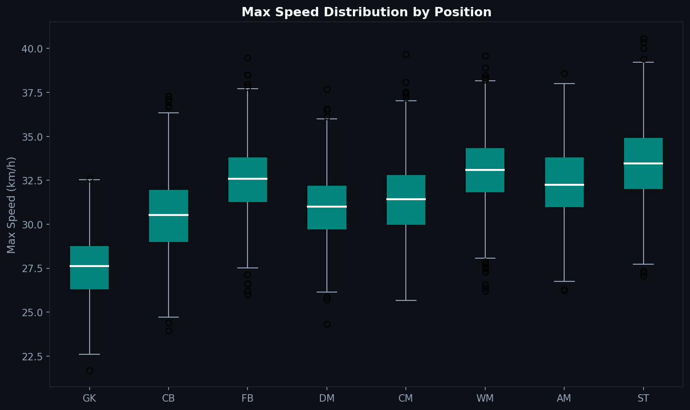
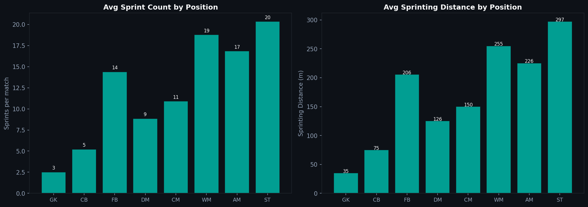
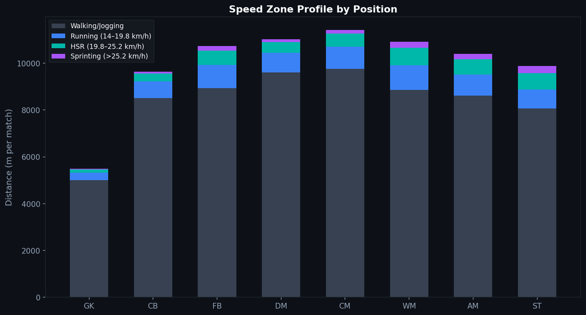

# P.2 — Sprint Profiles: Speed Zones by Position

Who is the fastest player on the pitch? The question sounds simple. The data makes it complicated — because raw max speed tells you less than how speed is distributed across zones, positions, and match phases.

---

## Speed Zones

Physical performance data divides player movement into zones based on running velocity:

| Zone | Speed Range |
|---|---|
| Walking | < 7 km/h |
| Jogging | 7–14 km/h |
| Running | 14–19.8 km/h |
| High-Speed Running (HSR) | 19.8–25.2 km/h |
| Sprinting | > 25.2 km/h |

These thresholds come from peer-reviewed sports science literature (Di Salvo et al. 2007; Bradley et al. 2009). They are not universal — some providers use different cutoffs — but they are the most common reference standard in professional football.

---

## Max Speed by Position

Wingers and fullbacks reach the highest maximum speeds. This is consistent with the sports science literature: wide players cover the most ground at high intensity and operate in open spaces where sustained sprinting is possible.

Goalkeepers have the lowest max speeds, which is expected. Their movement is mostly positional and reactive, with full sprints rare and short.

Central defenders and defensive midfielders sit in the middle — capable of reaching high speeds but doing so less often and over shorter distances.

---

## Sprint Count and Sprinting Distance

Wingers and fullbacks lead on both sprint count and total sprinting distance. But the picture is more nuanced than just "wide players sprint more."

Strikers have a comparably high sprint count despite covering less total distance — their sprints are often short explosive runs into space rather than sustained high-intensity efforts.

Defensive midfielders sprint less often but cover more total ground. Their physical profile is about continuous movement, not explosive bursts.

---

## The Full Speed Zone Stack

The stacked bar chart shows how each position distributes its total distance across zones. The insight here is about proportions, not just totals.

Goalkeepers cover most of their total distance at low intensity — almost no HSR or sprinting. Central defenders cover relatively more walking/jogging than outfield positions.

Wide midfielders and forwards have the highest proportion of their total distance in the HSR and sprinting zones. For these positions, high-intensity output is not a bonus metric — it is central to their function.

---

## Why This Matters for Analysis

Comparing a fullback's total distance to a striker's total distance tells you very little. Comparing their zone proportions tells you something about how each player's physical profile fits their tactical role.

A fullback who covers a lot of distance but almost none in the sprint zone may be positioned conservatively or substituted early. A striker with very few sprints may not be making the off-ball runs their team needs.

Sprint profiles are a diagnostic tool — they do not tell you why the pattern exists, but they tell you exactly where to look.

---

*Data: Synthetic GPS dataset. Parameters derived from Mohr et al. (2003), Bradley et al. (2009), and Di Salvo et al. (2007). Values are illustrative and should not be cited as empirical measurements.*

Full notebook: [notebook.ipynb](notebook.ipynb)

---

**Series 3 — Physical Performance**

[← P.1 GPS Introduction](../P.1_GPS_Introduction/article.md) · [P.3 Distance Analysis →](../P.3_Distance_Analysis/article.md)
