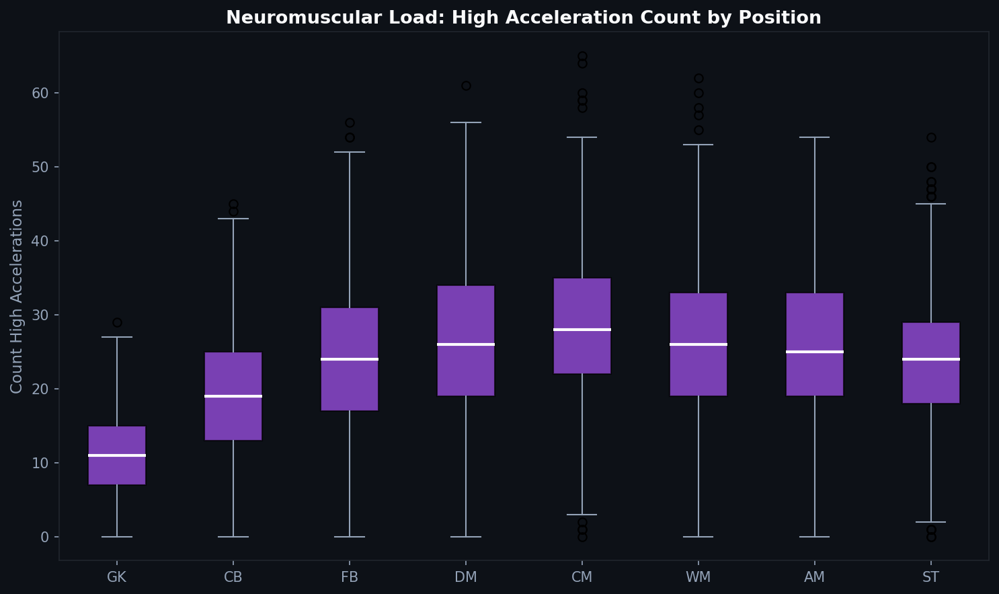
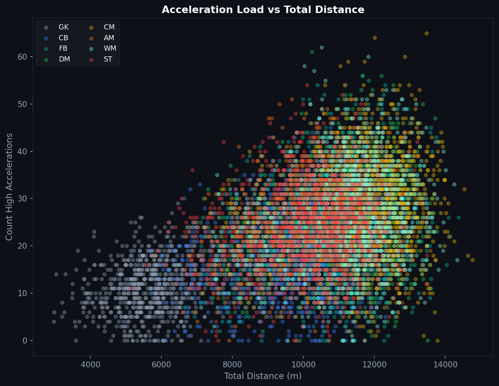
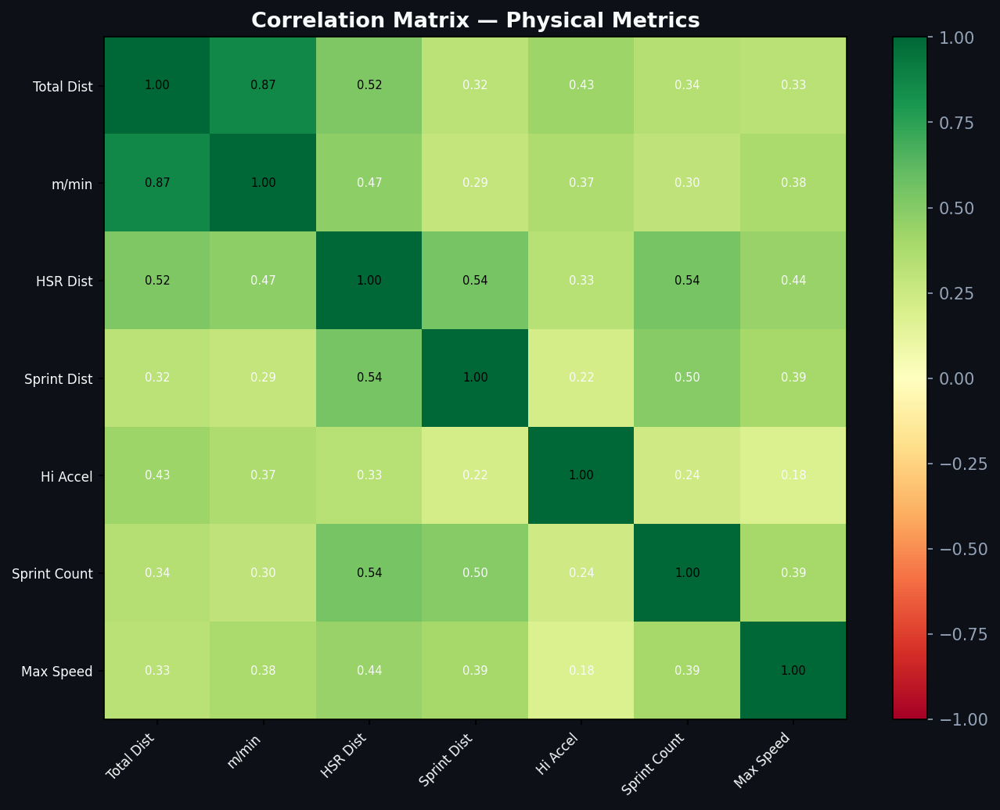

# P.4 — Accelerations: The Hidden Fitness Metric

Total distance and max speed get most of the attention in physical performance analysis. But the metric most closely linked to muscular load, injury risk, and fatigue is one you rarely see discussed publicly: acceleration count.

---

## Why Accelerations Matter More Than Distance

Every time a player changes speed — whether accelerating from a jog to a sprint or decelerating from a sprint to a stop — they place significant mechanical load on their muscles, tendons, and joints. This neuromuscular load does not show up in total distance.

A player who walks 8 km and then sprints 200 meters covers only 8.2 km total. But if those 200 meters came in 20 short explosive bursts, their actual physical cost to the body is much higher than the distance suggests.

Sports scientists use acceleration count as a proxy for **neuromuscular load** — the cumulative mechanical stress on the body that is not captured by distance or speed metrics alone.

---

## Acceleration Load by Position

Wingers and forwards show the highest acceleration counts, consistent with their explosive movement patterns. They are repeatedly accelerating into space, decelerating to receive, and changing direction.

Goalkeepers have low acceleration counts, which aligns with their movement profile: most positioning is done at low speed, with explosive efforts only on shot-saving actions.

Central midfielders show moderate counts — their movement is more continuous than explosive, which means fewer but longer efforts.

---

## Acceleration vs. Total Distance: Two Different Stories

The scatter shows that acceleration load and total distance are related but not the same. A player can cover a lot of distance at steady moderate pace and accumulate low acceleration counts. Another can cover less distance but with constant starts and stops.

Wide players tend to cluster in the upper right — high distance and high accelerations. Central defenders cluster lower right — decent distance but far fewer accelerations. Goalkeepers sit isolated at the bottom left.

---

## The Correlation Matrix

The correlation matrix shows how physical metrics relate to each other. A few observations:

- **Total distance and m/min** correlate strongly — unsurprisingly, players who cover more ground tend to do so at higher average intensity.
- **High accelerations and sprint count** are moderately correlated — explosive movement types tend to co-occur.
- **Max speed and sprinting distance** are strongly linked — reaching high speeds requires sustained effort.

The matrix also highlights what is relatively independent: acceleration count is less correlated with total distance than you might expect. This is the key insight — acceleration load is a partially independent dimension of physical stress, not just a proxy for distance.

---

## Practical Use in Conditioning

When practitioners monitor players for injury risk and fatigue, they often look at acceleration count trends alongside distance. A player whose weekly acceleration count is 20% above their seasonal average is at higher risk of soft tissue injury, regardless of whether their total distance has changed.

This is also why substitutions are sometimes made not because a player is slowing down in distance terms, but because their acceleration capacity has dropped — they are no longer making those explosive first steps.

---

*Data: Synthetic GPS dataset. Parameters derived from Mohr et al. (2003), Bradley et al. (2009), and Di Salvo et al. (2007). Values are illustrative and should not be cited as empirical measurements.*

Full notebook: [notebook.ipynb](notebook.ipynb)

---

**Series 3 — Physical Performance**

[← P.3 Distance Analysis](../P.3_Distance_Analysis/article.md) · [P.5 Pressing Space →](../P.5_Pressing_Space/article.md)
