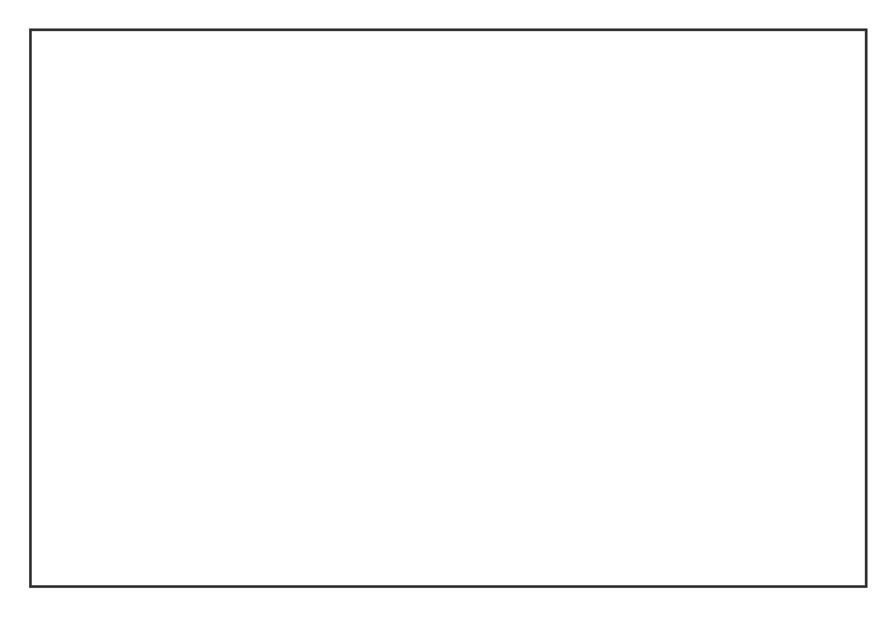
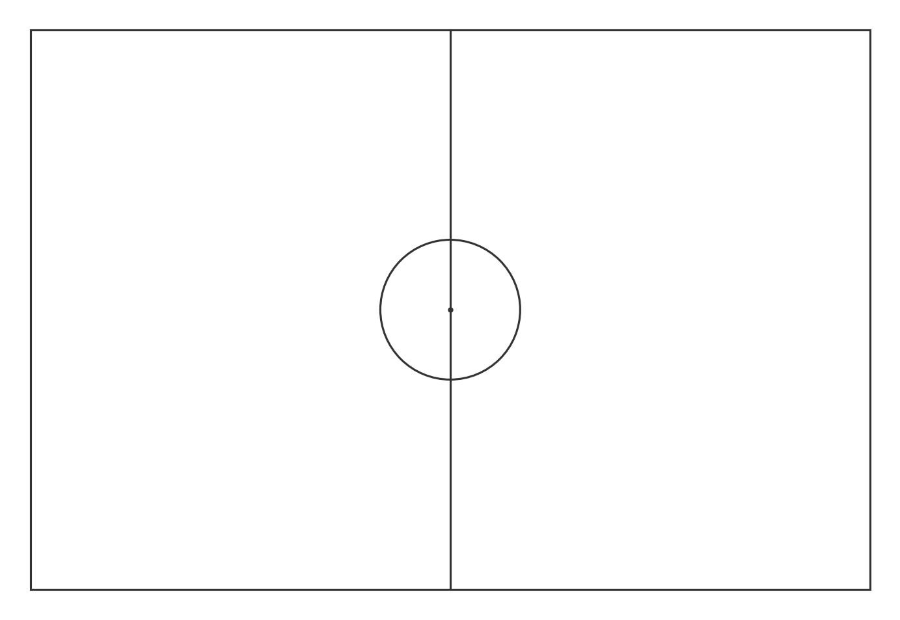
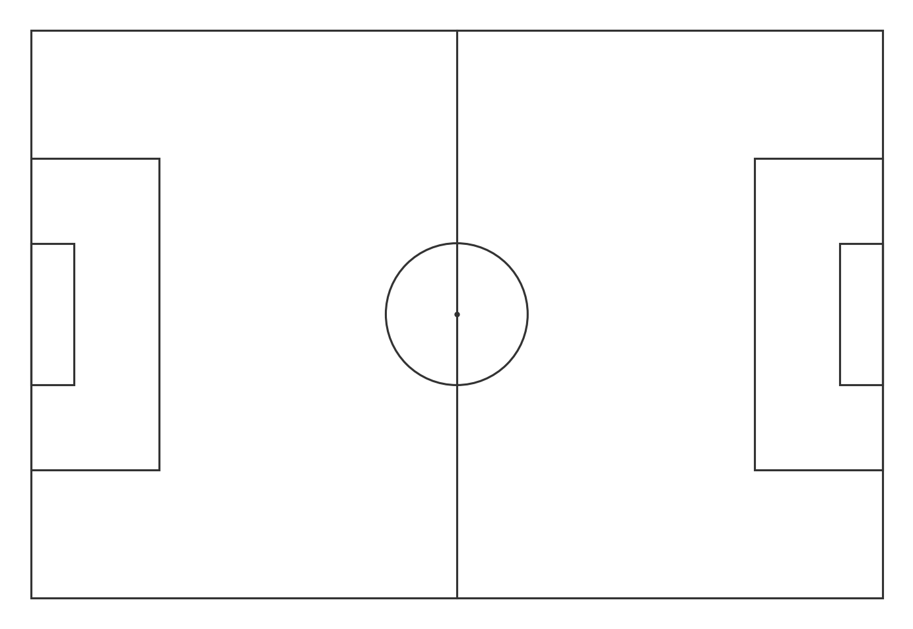
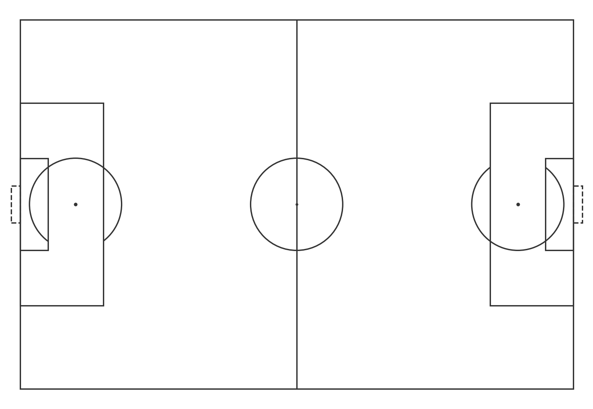
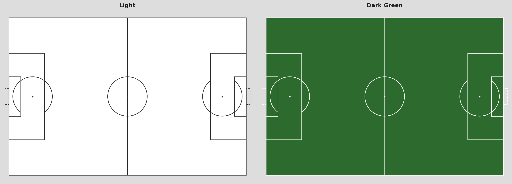

# Drawing a Football Pitch in Python from Scratch

Before we can visualize any data, we need a canvas. Every shot map, pass network, or heatmap in this series gets drawn on top of a pitch. So let's build one.

We're using pure matplotlib. No special football libraries yet. Just rectangles, circles, and lines placed at the right coordinates.

By the end of this article you'll have a reusable `draw_pitch()` function you can drop into any notebook.

---

## Setup

```python
import matplotlib.pyplot as plt
import matplotlib.patches as patches
from matplotlib.patches import Arc
```

That's all we need. No football-specific libraries, no extra installs.

---

## The Coordinate System (Quick Recap)

From Article 1.1: Statsbomb uses a **120 x 80** unit pitch. Origin `(0, 0)` is the bottom-left corner. We draw everything relative to that.

The real pitch dimensions don't matter here. The 120x80 is just the unit system Statsbomb uses, and we match it exactly so event coordinates land in the right spot.

---

## Step 1: Figure and Axes

Everything in matplotlib starts with a figure and an axes object.

```python
fig, ax = plt.subplots(figsize=(12, 8))
ax.set_facecolor('white')
```

`figsize=(12, 8)` sets the output size in inches. We'll adjust the aspect ratio properly at the end.

---

## Step 2: The Outer Boundary

A pitch is just a rectangle. `plt.Rectangle` takes the bottom-left corner, width, and height.

```python
ax.add_patch(plt.Rectangle((0, 0), 120, 80,
             fill=False, edgecolor='#333333', linewidth=2))
```

`fill=False` means we only draw the border, not a filled rectangle.



---

## Step 3: Halfway Line and Centre Circle

```python
# Halfway line
ax.plot([60, 60], [0, 80], color='#333333', linewidth=1.5)

# Centre circle
centre_circle = plt.Circle((60, 40), 10,
                fill=False, edgecolor='#333333', linewidth=1.5)
ax.add_patch(centre_circle)

# Centre spot
ax.plot(60, 40, 'o', color='#333333', markersize=3)
```

The centre of the pitch is at `(60, 40)`. The circle has a radius of 10 units.



---

## Step 4: Penalty Areas

There are two penalty areas, one on each side.

```python
# Left penalty area
ax.add_patch(plt.Rectangle((0, 18), 18, 44,
             fill=False, edgecolor='#333333', linewidth=1.5))

# Right penalty area
ax.add_patch(plt.Rectangle((102, 18), 18, 44,
             fill=False, edgecolor='#333333', linewidth=1.5))
```

Left area starts at x=0, runs 18 units deep. It spans y=18 to y=62, so height=44. The right area mirrors it at x=102.



---

## Step 5: Six-Yard Boxes

The small boxes in front of each goal.

```python
# Left 6-yard box
ax.add_patch(plt.Rectangle((0, 30), 6, 20,
             fill=False, edgecolor='#333333', linewidth=1.5))

# Right 6-yard box
ax.add_patch(plt.Rectangle((114, 30), 6, 20,
             fill=False, edgecolor='#333333', linewidth=1.5))
```

---

## Step 6: Goals

Goals extend slightly beyond the pitch boundary. We use `linestyle='--'` to make them visually distinct.

```python
# Left goal
ax.add_patch(plt.Rectangle((-2, 36), 2, 8,
             fill=False, edgecolor='#333333', linewidth=1.5, linestyle='--'))

# Right goal
ax.add_patch(plt.Rectangle((120, 36), 2, 8,
             fill=False, edgecolor='#333333', linewidth=1.5, linestyle='--'))
```

The left goal sits at x=-2 (two units outside the pitch). Width=2 brings it back to x=0. It spans y=36 to y=44, so height=8.

---

## Step 7: Penalty Spots and Arcs

```python
# Penalty spots
ax.plot(12, 40, 'o', color='#333333', markersize=4)
ax.plot(108, 40, 'o', color='#333333', markersize=4)

# Penalty arcs
left_arc = Arc((12, 40), 20, 20, angle=0,
               theta1=307, theta2=233, color='#333333', linewidth=1.5)
right_arc = Arc((108, 40), 20, 20, angle=0,
                theta1=127, theta2=53, color='#333333', linewidth=1.5)

ax.add_patch(left_arc)
ax.add_patch(right_arc)
```

The `Arc` class draws only part of a circle. `theta1` and `theta2` define the start and end angles. For the left arc we want the part that sticks outside the penalty area, so we draw from 307° to 233° going counter-clockwise.



---

## Step 8: Axis Settings

Two things matter here: aspect ratio and hiding the axis frame.

```python
ax.set_xlim(-3, 123)
ax.set_ylim(-3, 83)
ax.set_aspect('equal')
ax.axis('off')
```

`set_aspect('equal')` makes sure one unit on x equals one unit on y. Without it the pitch looks stretched. The limits add a small margin around the pitch. `axis('off')` removes the tick marks and frame.

---

## The Complete Function

Wrap everything into a reusable function:

```python
def draw_pitch(ax, color='white', line_color='#333333'):
    ax.set_facecolor(color)
    lc, lw = line_color, 1.5

    ax.add_patch(plt.Rectangle((0, 0), 120, 80,
                 fill=False, edgecolor=lc, linewidth=lw))
    ax.plot([60, 60], [0, 80], color=lc, linewidth=lw)
    ax.add_patch(plt.Circle((60, 40), 10,
                 fill=False, edgecolor=lc, linewidth=lw))
    ax.plot(60, 40, 'o', color=lc, markersize=2)

    ax.add_patch(plt.Rectangle((0, 18), 18, 44,
                 fill=False, edgecolor=lc, linewidth=lw))
    ax.add_patch(plt.Rectangle((102, 18), 18, 44,
                 fill=False, edgecolor=lc, linewidth=lw))
    ax.add_patch(plt.Rectangle((0, 30), 6, 20,
                 fill=False, edgecolor=lc, linewidth=lw))
    ax.add_patch(plt.Rectangle((114, 30), 6, 20,
                 fill=False, edgecolor=lc, linewidth=lw))

    ax.add_patch(plt.Rectangle((-2, 36), 2, 8,
                 fill=False, edgecolor=lc, linewidth=lw, linestyle='--'))
    ax.add_patch(plt.Rectangle((120, 36), 2, 8,
                 fill=False, edgecolor=lc, linewidth=lw, linestyle='--'))

    ax.plot(12, 40, 'o', color=lc, markersize=3)
    ax.plot(108, 40, 'o', color=lc, markersize=3)

    ax.add_patch(Arc((12, 40), 20, 20, angle=0,
                     theta1=307, theta2=233, color=lc, linewidth=lw))
    ax.add_patch(Arc((108, 40), 20, 20, angle=0,
                     theta1=127, theta2=53, color=lc, linewidth=lw))

    ax.set_xlim(-3, 123)
    ax.set_ylim(-3, 83)
    ax.set_aspect('equal')
    ax.axis('off')
```

Call it like this:

```python
fig, ax = plt.subplots(figsize=(12, 8))
draw_pitch(ax)
plt.show()
```

---

## Light vs Dark

Passing just two arguments gives you completely different looks:

```python
# Light
fig, ax = plt.subplots(figsize=(12, 8), facecolor='white')
draw_pitch(ax, color='white', line_color='#333333')

# Dark green
fig, ax = plt.subplots(figsize=(12, 8), facecolor='#1a1a1a')
draw_pitch(ax, color='#2d6a2d', line_color='#cccccc')
```



The dark version works well for shot maps where you want the data points to pop. The light version is cleaner for pass networks and heatmaps.

---

## Bonus: mplsoccer

If you don't want to build the pitch from scratch every time, [mplsoccer](https://mplsoccer.readthedocs.io) is the go-to library in the football analytics community. It gives you a pitch in two lines:

```python
from mplsoccer import Pitch

pitch = Pitch(pitch_color='grass', line_color='white', stripe=True)
fig, ax = pitch.draw(figsize=(12, 8))
```

For this series we keep using our own `draw_pitch()` because it's simpler to understand and easier to customize. But mplsoccer is worth knowing for more complex visualizations.

---

## What's Next?

We have a pitch. Now we need something to put on it. In **Article 1.3** we load shot data, calculate xG, and build our first real shot map.

[Article 1.3: Shot Maps](../1-3-shot-maps/)

---

*Part of **Football Analytics with Python** — a series that takes you from raw Statsbomb data to real tactical analyses.*

*Series: [1.1 The Data](../1-1-data/) · **1.2 Drawing a Pitch** · [1.3 Shot Maps](../1-3-shot-maps/) · [1.4 Pass Networks](../1-4-pass-networks/) · [1.5 Heatmaps](../1-5-heatmaps/)*

*Code: [notebook.ipynb](https://github.com/TwinAnalytics/football-analytics-blog)*
