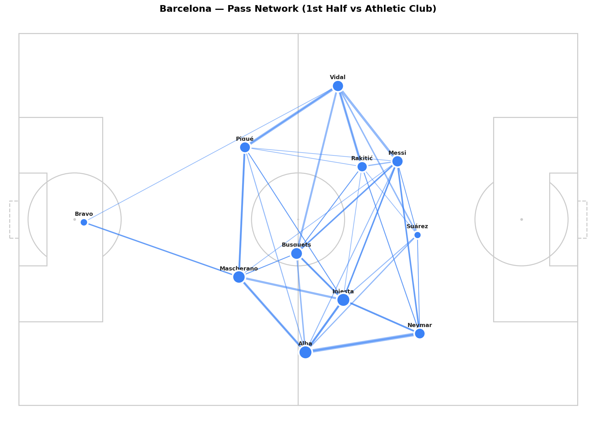

# Pass Networks: Who Plays with Whom?

A pass network makes the structure of a team visible. You can see which players are central, which ones are isolated, and where the ball flows most often.

In this article we build a pass network for Barcelona's 6-0 win over Athletic Club in La Liga 2015/16. The season of MSN: Messi, Suárez, Neymar. The network shows what made them so hard to stop.

---

## Setup

```python
import sys
import numpy as np
import pandas as pd
import matplotlib.pyplot as plt

sys.path.append('/path/to/Blog/assets/helpers')
from data_loader import load_competitions, load_matches, load_events, flatten_events
from pitch import draw_pitch
```

networkx is the standard Python library for working with graphs and networks.

```python
pip install networkx
```

```python
import networkx as nx
```

---

## Load the Match

```python
MATCH_ID = 266149

comp_df = load_competitions()
row = comp_df[
    (comp_df['competition_name'] == 'La Liga') &
    (comp_df['season_name'] == '2015/2016')
].iloc[0]

matches = load_matches(row['competition_id'], row['season_id'])
match_row = matches[matches['match_id'] == MATCH_ID].iloc[0]

home_team = match_row['home_team']['home_team_name']
away_team = match_row['away_team']['away_team_name']

print(f'{home_team} {match_row["home_score"]}-{match_row["away_score"]} {away_team}')
```

```
Barcelona 6-0 Athletic Club
```

---

## Filter the Passes

We use only first-half passes from Barcelona. Two reasons:
• Lineups change in the second half due to substitutions, which makes the network messier
• We want a clean picture of the starting formation before tactical changes

We also filter to completed passes only. A null value in `pass_outcome` means the pass was successful.

```python
raw = load_events(MATCH_ID)
df = flatten_events(raw)

passes = df[
    (df['type'] == 'Pass') &
    (df['team'] == home_team) &
    (df['period'] == 1) &
    (df['pass_outcome'].isna())
].copy()

print(f'Completed first-half passes by {home_team}: {len(passes)}')
```

---

## Calculate Average Player Positions

For each player, we calculate their average position from all their actions in the first half, not just passes, but any event with an (x, y) coordinate. This is more stable than using passes alone.

```python
touches = df[
    (df['team'] == home_team) &
    (df['period'] == 1) &
    df['x'].notna()
].copy()

avg_positions = (
    touches.groupby('player')[['x', 'y']]
    .mean()
    .rename(columns={'x': 'avg_x', 'y': 'avg_y'})
)

print(avg_positions.sort_values('avg_x').head(10))
```

The output shows your defensive players at the left (low x) and attacking players at the right (high x). That's the formation unfolding in numbers.

---

## Build the Pass Connection Matrix

Count how many passes went from each player to each other player.

```python
pass_counts = (
    passes.groupby(['player', 'pass_recipient'])
    .size()
    .reset_index(name='count')
)

pass_counts = pass_counts[pass_counts['count'] >= 3]

print(f'Connections with 3+ passes: {len(pass_counts)}')
```

Filtering at 3+ passes removes noise. Two isolated exchanges don't reveal structure; repeated connections do.

---

## Draw the Network

Nodes are players placed at their average position. Edges are the pass connections: thicker lines mean more passes between that pair.

```python
fig, ax = plt.subplots(figsize=(14, 9))
draw_pitch(ax, color='#f8f8f8', line_color='#cccccc')

players_in_network = set(pass_counts['player']) | set(pass_counts['pass_recipient'])

# Draw edges
for _, row in pass_counts.iterrows():
    if row['player'] not in avg_positions.index:
        continue
    if row['pass_recipient'] not in avg_positions.index:
        continue

    x1, y1 = avg_positions.loc[row['player'], ['avg_x', 'avg_y']]
    x2, y2 = avg_positions.loc[row['pass_recipient'], ['avg_x', 'avg_y']]

    ax.plot([x1, x2], [y1, y2],
            color='#3b82f6',
            linewidth=row['count'] * 0.35,
            alpha=0.55, zorder=2)

# Draw nodes
for player, pos in avg_positions.iterrows():
    if player not in players_in_network:
        continue
    total = passes[passes['player'] == player].shape[0]
    ax.scatter(pos['avg_x'], pos['avg_y'],
               s=total * 10,
               color='#3b82f6', edgecolors='white',
               linewidths=2.5, zorder=4)
    ax.annotate(player.split()[-1],
                (pos['avg_x'], pos['avg_y']),
                textcoords='offset points', xytext=(0, 10),
                fontsize=8.5, ha='center', fontweight='bold', color='#222')

ax.set_title(f'{home_team} — Pass Network (1st Half vs {away_team})',
             fontweight='bold', fontsize=14, pad=12)
plt.tight_layout()
plt.savefig('figures/pass_network_barcelona.png', dpi=150, bbox_inches='tight')
plt.show()
```



---

## Reading the Network

Three things to look for:

• **Node size**: bigger nodes mean more passes played. The player who touches the ball constantly is the biggest node. In most teams this is the central midfielder.
• **Edge thickness**: thicker lines mean a stronger connection. The most frequent partnerships stand out immediately. In a 4-3-3, you'll usually see the strongest edges between the holding midfielder and the two center-backs.
• **Position on the pitch**: where the node sits reflects the player's actual average position. Center-backs low and central, wingers wide and high, forwards pushed up. The formation becomes visible.

In Barcelona's 6-0 win, the network shows a dense spine through the center. Busquets sits deep as the connector. Messi drifts in from the right half-space. Neymar stays wide on the left but picks up the ball higher up the pitch.

---

## Compare First Half vs. Second Half

One useful variation: compare the same team's network before and after key substitutions. The structure often changes visibly.

```python
passes_h2 = df[
    (df['type'] == 'Pass') &
    (df['team'] == home_team) &
    (df['period'] == 2) &
    (df['pass_outcome'].isna())
].copy()

touches_h2 = df[
    (df['team'] == home_team) &
    (df['period'] == 2) &
    df['x'].notna()
].copy()

avg_positions_h2 = (
    touches_h2.groupby('player')[['x', 'y']]
    .mean()
    .rename(columns={'x': 'avg_x', 'y': 'avg_y'})
)
```

Build both panels with the same draw code and put them side by side using `plt.subplots(1, 2)`. When a defensive midfielder is replaced by a winger, the network structure shifts: the center becomes less dense, and you lose connections through the middle.

---

## What's Next?

Pass networks show connections between players. Heatmaps show zones of activity. In **Article 1.5** we aggregate all touch coordinates into density maps: where a team operates, where Messi spent his time across an entire season, and where Leverkusen pressed in the Bundesliga.

[Article 1.5: Heatmaps](../1-5-heatmaps/)

---

*Part of **Football Analytics with Python**, a series that takes you from raw Statsbomb data to real tactical analyses.*

*Series: [1.1 The Data](../1-1-data/) · [1.2 Drawing a Pitch](../1-2-pitch/) · [1.3 Shot Maps](../1-3-shot-maps/) · **1.4 Pass Networks** · [1.5 Heatmaps](../1-5-heatmaps/)*

*Data: [Statsbomb Open Data](https://github.com/statsbomb/open-data) · Code: [notebook.ipynb](https://github.com/TwinAnalytics/football-analytics-blog)*
