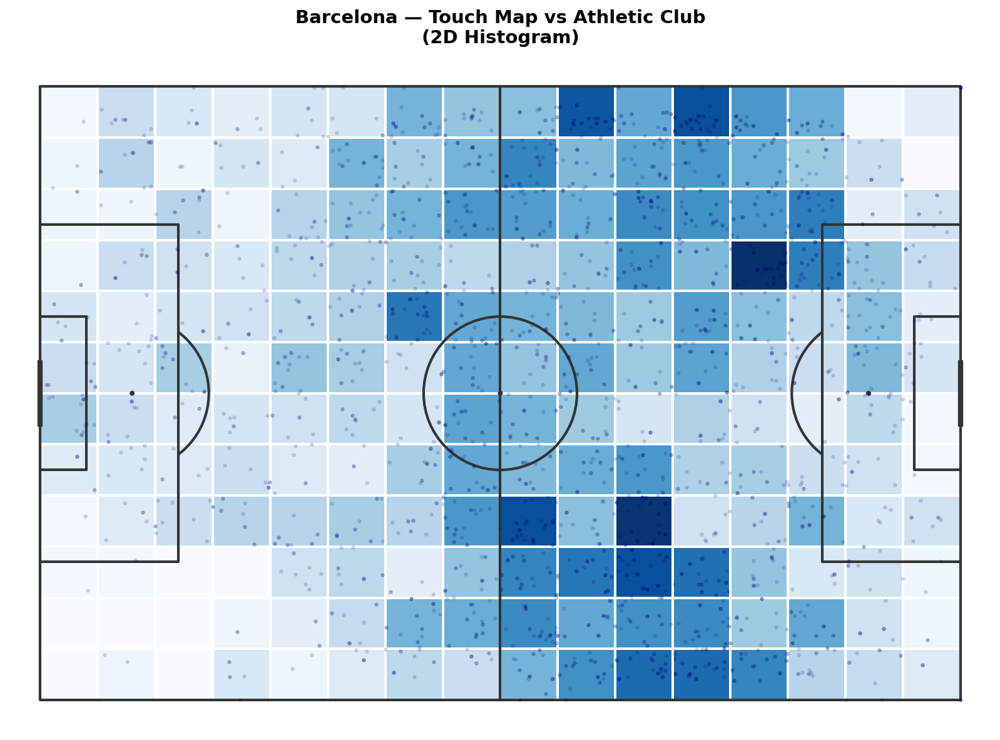
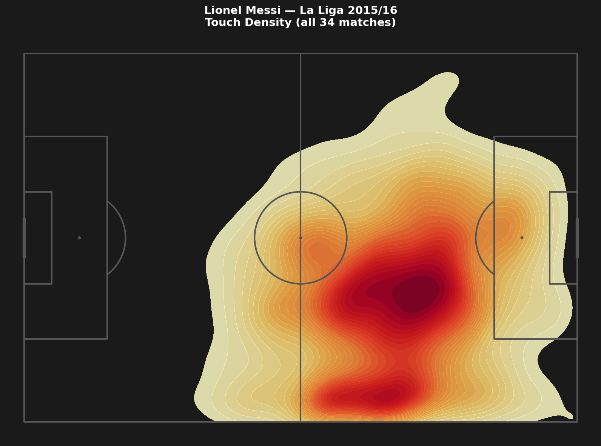
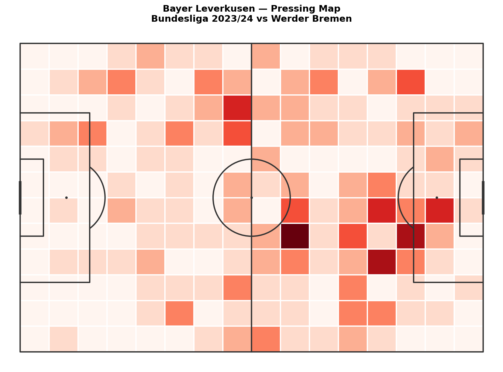

# Heatmaps: Where Does a Team or Player Actually Operate?

A shot map shows individual events. A heatmap shows everything at once — the density of activity across the pitch, turning hundreds of separate touches into one continuous picture.

In this article we build three heatmaps: a team touch map for one match, Messi's activity zone across the entire La Liga 2015/16 season, and a pressing map for Bayer Leverkusen from the Bundesliga 2023/24.

---

## Setup

We use mplsoccer for the heatmaps. It has built-in support for binned heatmaps and KDE plots on a football pitch.

```python
pip install mplsoccer scipy
```

```python
import sys
import json
import os
import numpy as np
import pandas as pd
import matplotlib.pyplot as plt
from mplsoccer import Pitch

sys.path.append('/path/to/Blog/assets/helpers')
from data_loader import load_competitions, load_matches, load_events, flatten_events
```

---

## Part 1: Team Touch Map — One Match

A touch map aggregates all events with an (x, y) coordinate for a given team in a given match. It shows where the team operated: where they received passes, made runs, pressed, and built play.

We load Barcelona vs Athletic Club from La Liga 2015/16 (the same match as Article 1.4).

```python
MATCH_ID = 266149

comp_df = load_competitions()
row = comp_df[
    (comp_df['competition_name'] == 'La Liga') &
    (comp_df['season_name'] == '2015/2016')
].iloc[0]

matches = load_matches(row['competition_id'], row['season_id'])
match_row = matches[matches['match_id'] == MATCH_ID].iloc[0]

home_team = match_row['home_team']['home_team_name']
away_team = match_row['away_team']['away_team_name']

raw = load_events(MATCH_ID)
df = flatten_events(raw)
```

Pull all events with coordinates for Barcelona:

```python
touches_barca = df[
    (df['team'] == home_team) &
    df['x'].notna()
].copy()

print(f'{home_team} touches: {len(touches_barca)}')
```

---

## 2D Histogram: The Simple Version

A 2D histogram divides the pitch into a grid of cells and counts how many touches fell into each cell. Simple, fast, easy to read.

```python
pitch = Pitch(pitch_color='white', line_color='#333333', line_zorder=2)
fig, ax = pitch.draw(figsize=(12, 8))

bin_statistic = pitch.bin_statistic(
    touches_barca['x'], touches_barca['y'],
    statistic='count', bins=(16, 12)
)

pitch.heatmap(bin_statistic, ax=ax, cmap='Blues', edgecolors='white')
pitch.scatter(touches_barca['x'], touches_barca['y'],
              ax=ax, s=5, color='navy', alpha=0.15, zorder=3)

ax.set_title(f'{home_team} — Touch Map vs {away_team}', fontweight='bold', fontsize=14, pad=10)
plt.tight_layout()
plt.savefig('figures/team_touch_hist.png', dpi=150, bbox_inches='tight')
plt.show()
```



The darker the cell, the more activity there. Immediately you see where the team concentrated their play.

---

## KDE: The Smooth Version

A KDE (Kernel Density Estimation) treats each touch as a small bell curve and adds them all up. The result is a smooth gradient rather than a grid of squares.

```python
pitch = Pitch(pitch_color='white', line_color='#333333', line_zorder=2)
fig, ax = pitch.draw(figsize=(12, 8))

pitch.kdeplot(
    touches_barca['x'], touches_barca['y'],
    ax=ax, cmap='Blues', levels=20, fill=True, alpha=0.8
)

ax.set_title(f'{home_team} — Touch Density vs {away_team}', fontweight='bold', fontsize=14, pad=10)
plt.tight_layout()
plt.savefig('figures/team_touch_kde.png', dpi=150, bbox_inches='tight')
plt.show()
```

**2D histogram vs. KDE:** The histogram is better when you have many data points and want precise cell counts. KDE is better when you have fewer points and want to show the overall shape of activity. For a single match, KDE often looks cleaner. For a full-season analysis with thousands of touches, both work well.

---

## Part 2: Messi Touch Map — Full Season

A single match can be noisy. Messi might play wide in one game and central in another depending on the opponent. A season-wide touch map shows his actual positional profile.

We load all La Liga 2015/16 matches and extract Messi's touches from each one.

```python
DATA_DIR = '/path/to/open-data/data'

matches_df = load_matches(row['competition_id'], row['season_id'])
all_messi_touches = []

for _, match in matches_df.iterrows():
    mid = match['match_id']
    path = os.path.join(DATA_DIR, 'events', f'{mid}.json')
    if not os.path.exists(path):
        continue
    with open(path) as f:
        raw = json.load(f)
    events = flatten_events(raw)
    messi = events[
        (events['player'] == 'Lionel Andrés Messi Cuccittini') &
        events['x'].notna()
    ].copy()
    all_messi_touches.append(messi)

messi_df = pd.concat(all_messi_touches, ignore_index=True)
print(f"Messi touches in La Liga 2015/16: {len(messi_df)}")
```

```
Messi touches in La Liga 2015/16: 7842
```

Now plot the heatmap:

```python
pitch = Pitch(pitch_color='#1a1a1a', line_color='#555555', line_zorder=2)
fig, ax = pitch.draw(figsize=(12, 8))
fig.patch.set_facecolor('#1a1a1a')

pitch.kdeplot(
    messi_df['x'], messi_df['y'],
    ax=ax, cmap='YlOrRd', levels=30, fill=True, alpha=0.85
)

ax.set_title("Lionel Messi — La Liga 2015/16\nTouch Density (all 34 matches)",
             fontweight='bold', fontsize=14, color='white', pad=12)
plt.tight_layout()
plt.savefig('figures/messi_touch_map.png', dpi=150, bbox_inches='tight')
plt.show()
```



The map shows Messi's positional profile across the entire season. He spends most of his time in the right half-space — neither a pure winger nor a center-forward. He drops deep to receive, then drives toward goal. The concentration in the right channel and penalty area together tell you everything about his role in this team.

---

## Part 3: Pressing Heatmap

Pressure events tell you where a team applied defensive pressure — where they chased, pressed, and forced the opponent into mistakes. A pressing heatmap shows the team's defensive shape.

We use the Bayer Leverkusen match from Article 1.1: Bundesliga 2023/24, match 3895302.

```python
MATCH_ID_LEV = 3895302

raw_lev = load_events(MATCH_ID_LEV)
df_lev = flatten_events(raw_lev)

pressure = df_lev[
    (df_lev['type'] == 'Pressure') &
    (df_lev['team'] == 'Bayer Leverkusen') &
    df_lev['x'].notna()
].copy()

print(f'Leverkusen pressure events: {len(pressure)}')
```

```python
pitch = Pitch(pitch_color='white', line_color='#333333', line_zorder=2)
fig, ax = pitch.draw(figsize=(12, 8))

bin_statistic = pitch.bin_statistic(
    pressure['x'], pressure['y'],
    statistic='count', bins=(16, 12)
)

pitch.heatmap(bin_statistic, ax=ax, cmap='Reds', edgecolors='white')

ax.set_title("Bayer Leverkusen — Pressing Map\nBundesliga 2023/24 vs Werder Bremen",
             fontweight='bold', fontsize=14, pad=10)
plt.tight_layout()
plt.savefig('figures/pressing_heatmap.png', dpi=150, bbox_inches='tight')
plt.show()
```



The pressing map reveals where Leverkusen apply pressure — and where they don't. If the heat concentrates in the opponent's half, it's a high-pressing team. If it's concentrated in their own half, they press deeper and invite the opponent forward before engaging.

---

## Side by Side: Two Teams, Two Styles

The most useful version compares both teams' pressing in the same match.

```python
fig, axes = plt.subplots(1, 2, figsize=(22, 8))
fig.patch.set_facecolor('#f0f0f0')

teams = ['Bayer Leverkusen', 'Werder Bremen']
cmaps = ['Reds', 'Blues']

for ax, team, cmap in zip(axes, teams, cmaps):
    pitch = Pitch(pitch_color='white', line_color='#444444', line_zorder=2)
    pitch.draw(ax=ax)

    team_press = df_lev[
        (df_lev['type'] == 'Pressure') &
        (df_lev['team'] == team) &
        df_lev['x'].notna()
    ]

    bin_stat = pitch.bin_statistic(
        team_press['x'], team_press['y'],
        statistic='count', bins=(16, 12)
    )
    pitch.heatmap(bin_stat, ax=ax, cmap=cmap, edgecolors='white')

    n = len(team_press)
    ax.set_title(f'{team}\n{n} pressure events', fontweight='bold', fontsize=13, pad=10)

plt.tight_layout(pad=2)
plt.savefig('figures/pressing_both_teams.png', dpi=150, bbox_inches='tight')
plt.show()
```

In a 5-0 result, the pressing maps tell the dominance story. Leverkusen pressed higher up the pitch. Werder pressed desperately late in the game, deep in their own half.

---

## What We Covered

• **2D histogram** — counts touches per grid cell. Simple and precise.
• **KDE** — smooth density map. Better for shape, harder to read exact numbers.
• **Single match** — shows one game's picture, which can be noisy.
• **Season-wide** — aggregates across games for a stable positional profile.
• **Pressing map** — shows defensive intensity zone by zone.

Heatmaps are one of the most versatile tools in football analytics. They work for any event type with an (x, y) coordinate: passes, shots, carries, pressure, duels. Change the filter, keep the code.

---

## What's Next?

That's the end of Series 1. You can now load Statsbomb data, draw a pitch, build shot maps, pass networks, and heatmaps. The next series goes deeper into the tactics — starting with a proper breakdown of how xG models work and when to trust them.

[Back to Series overview: Football Analytics with Python](../../)

---

*Part of **Football Analytics with Python** — a series that takes you from raw Statsbomb data to real tactical analyses.*

*Series: [1.1 The Data](../1-1-data/) · [1.2 Drawing a Pitch](../1-2-pitch/) · [1.3 Shot Maps](../1-3-shot-maps/) · [1.4 Pass Networks](../1-4-pass-networks/) · **1.5 Heatmaps***

*Data: [Statsbomb Open Data](https://github.com/statsbomb/open-data) · Code: [notebook.ipynb](https://github.com/TwinAnalytics/football-analytics-blog)*
