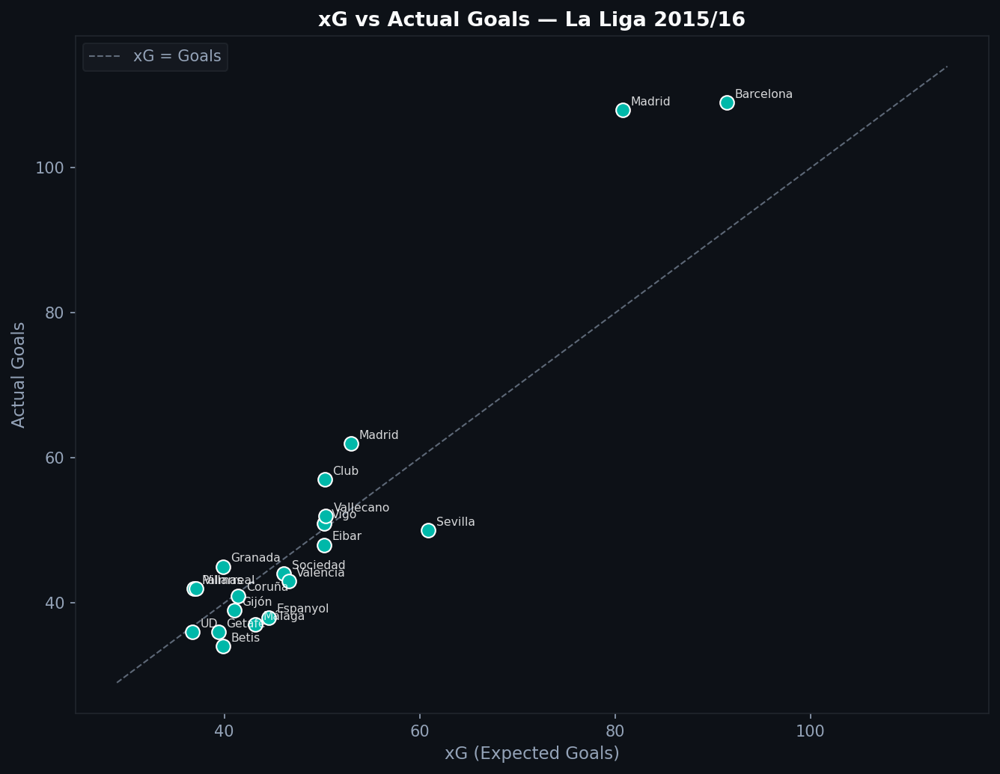
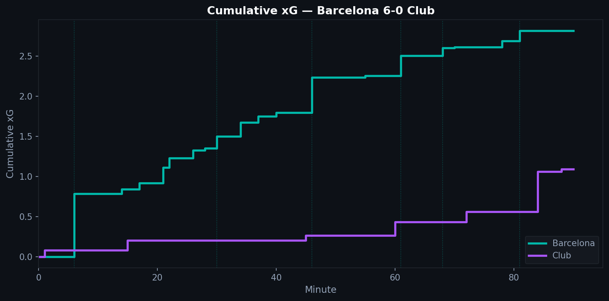
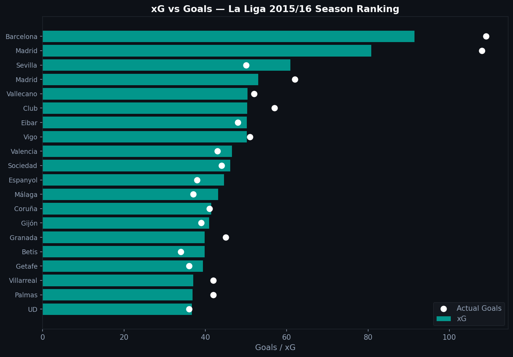

# 2.1 — What Is xG, and Why Is It Sometimes Wrong?

Expected Goals (xG) is one of the most-used metrics in football analytics. You see it on TV graphics, in post-match analysis, in scouting reports. But what does the number actually mean, and when should you not trust it?

---

## The Core Idea

Every shot has a probability of going in. That probability depends on where the shot was taken, how it was taken, and what happened just before it. xG is that probability.

A shot from six yards out, one-on-one with the goalkeeper, might have an xG of 0.65. A speculative effort from 30 yards might be 0.03. Add up all the xG values for a team over a match and you get their expected goals for that game.

The Statsbomb xG model accounts for:

- **Location**: distance and angle to goal
- **Body part**: headed shots score less often than foot shots
- **Shot technique**: volleys, chips, normal strikes
- **Game situation**: open play, set piece, corner
- **Preceding action**: was it a through ball? A cross?

---

## xG Over a Season

When you sum xG across 380 matches and compare it to actual goals, the numbers converge over large samples.

Teams that score more than their xG are outperforming their shooting quality. Teams below the line are underperforming.



Barcelona sits comfortably above the line in 2015/16. That gap represents a combination of exceptional finishing (Messi, Suárez, Neymar) and some statistical fortune. Teams closer to the diagonal are performing roughly at the level their chances would predict.

---

## Cumulative xG: Reading a Match

The most powerful use of xG is tracking a single game. A cumulative xG chart shows how chance-creation built up over 90 minutes.



In Barcelona's 6-0 win over Athletic Club, the xG line climbs steeply in the first half. The dotted vertical lines mark actual goals. When the line runs far ahead of goals, the team is converting at a high rate. When it lags behind, they are scoring from fewer and harder chances than the model would expect.

---

## Season Ranking

Across La Liga 2015/16, the xG rankings reveal which teams were genuinely dangerous versus which ones got results:



The white dots are actual goals. Teams where the dot sits far to the right are overperforming their xG. Teams where the dot is inside the bar are leaving chances unconverted.

---

## When xG Lies

**Single-match variance is high.** A 0.6 xG shot misses 40% of the time. Over one game, variance dominates. Over a season, it smooths out.

**Goalkeeper position is not in the model.** A shot hit toward a keeper standing centrally has a different real conversion probability than the same shot when the keeper is off his line. Basic xG models treat them identically.

**It measures shot quality, not decision quality.** A player who creates a 0.9 xG chance and misses gets no credit for the underlying work. A player who fires 30-yard efforts all game accumulates almost no xG even if one goes in.

The best use of xG is over large samples: full seasons, career trajectories. As a tool for understanding a single match result, treat it as context, not truth.

---

```python
import pandas as pd

all_shots = []
for match_id in matches['match_id']:
    raw = load_events(match_id)
    df = flatten_events(raw)
    shots = df[(df['type'] == 'Shot') & df['shot_statsbomb_xg'].notna()]
    all_shots.append(shots)

shots_df = pd.concat(all_shots, ignore_index=True)
team_xg = shots_df.groupby('team')['shot_statsbomb_xg'].sum()
```

Full notebook available in the [GitHub repository](https://github.com/TwinAnalytics/football-analytics-blog)

*Data: Statsbomb Open Data, La Liga 2015/16, 380 matches.*

---

**Series 2 — Tactical Analysis**

[← 1.5 Heatmaps](../../serie-1/1-5-heatmaps/) · [2.2 Pressing →](../2-2-ppda/)
