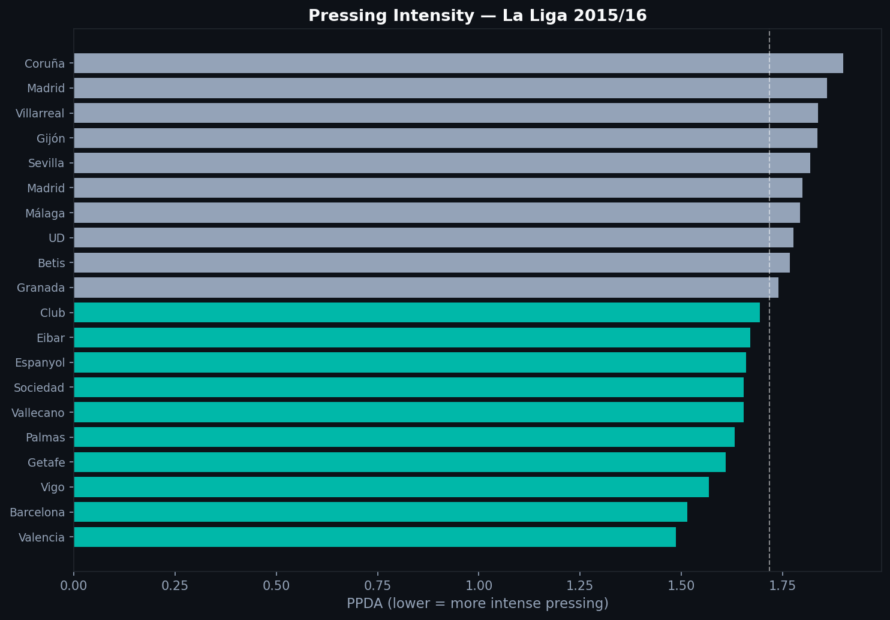
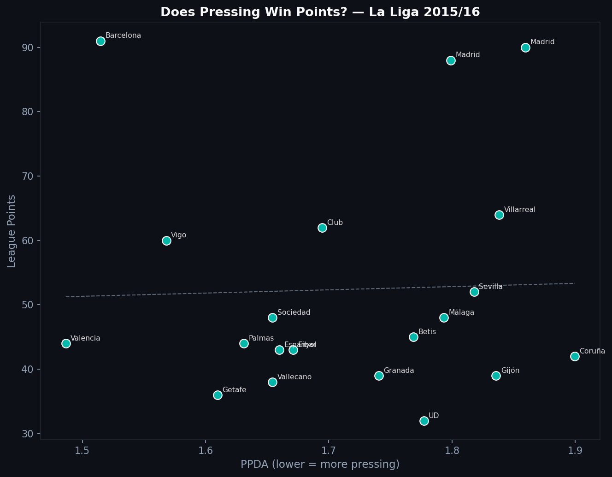

# 2.2 — Pressing in Numbers: What Is PPDA?

Every team presses. But not every team presses the same way. PPDA turns the vague idea of "pressing intensity" into a concrete number.

---

## What PPDA Measures

PPDA stands for **Passes Per Defensive Action**. The formula:

```
PPDA = Opponent passes in their own half / Defensive actions in their own half
```

Defensive actions include pressures, tackles, interceptions, and blocks executed in the opponent's half. A **low PPDA** means the pressing team wins the ball quickly. A **high PPDA** means the opponent circulates freely.

---

## La Liga 2015/16 Rankings



Teal bars are teams with below-median PPDA — pressing more intensely than average. Barcelona and Athletic Club sit near the top of pressing intensity. Athletic's press under Bielsa was already a reference point in European football. Barcelona's gegenpressing complemented their possession game with aggressive ball recovery.

---

## Does Pressing Win Points?



The trend slopes downward — teams with lower PPDA (more pressing) tend to accumulate more points. But the relationship is not clean. Several high-pressing teams had mediocre seasons, and several deeper-block teams performed well.

Pressing intensity and pressing quality are different things. PPDA measures how often you press, not how well-coordinated those actions are. A team can press frequently and chaotically. Another can press less often in well-organized traps. PPDA sees the former as the more intense presser.

---

## Implementation

```python
DEFENSIVE_ACTIONS = {'Pressure', 'Tackle', 'Interception', 'Block'}

for match_id in matches['match_id']:
    raw = load_events(match_id)
    df = flatten_events(raw)

    opp_passes_deep = df[
        (df['team'] == opp_team) &
        (df['type'] == 'Pass') &
        (df['x'] < 40)  # opponent's defensive third
    ]
    press_actions = df[
        (df['team'] == pressing_team) &
        (df['type'].isin(DEFENSIVE_ACTIONS)) &
        (df['x'] > 60)  # in opponent's half
    ]
    ppda = len(opp_passes_deep) / max(len(press_actions), 1)
```

The x thresholds follow the Statsbomb coordinate system (120-yard pitch).

---

## Limits

PPDA does not weight pressing actions by outcome. A pressure that wins the ball counts the same as one that fails. It also does not capture pressing shape: the positioning and compactness that make a press possible before the first touch. More sophisticated metrics look at recovery rates and time-to-press, but PPDA is the standard starting point.

---

Full notebook available in the [GitHub repository](https://github.com/TwinAnalytics/football-analytics-blog)

*Data: Statsbomb Open Data — La Liga 2015/16, 380 matches.*

---

**Series 2 — Tactical Analysis**

[← 2.1 xG](../2-1-xg/) · [2.3 Through Balls →](../2-3-through-balls/)
