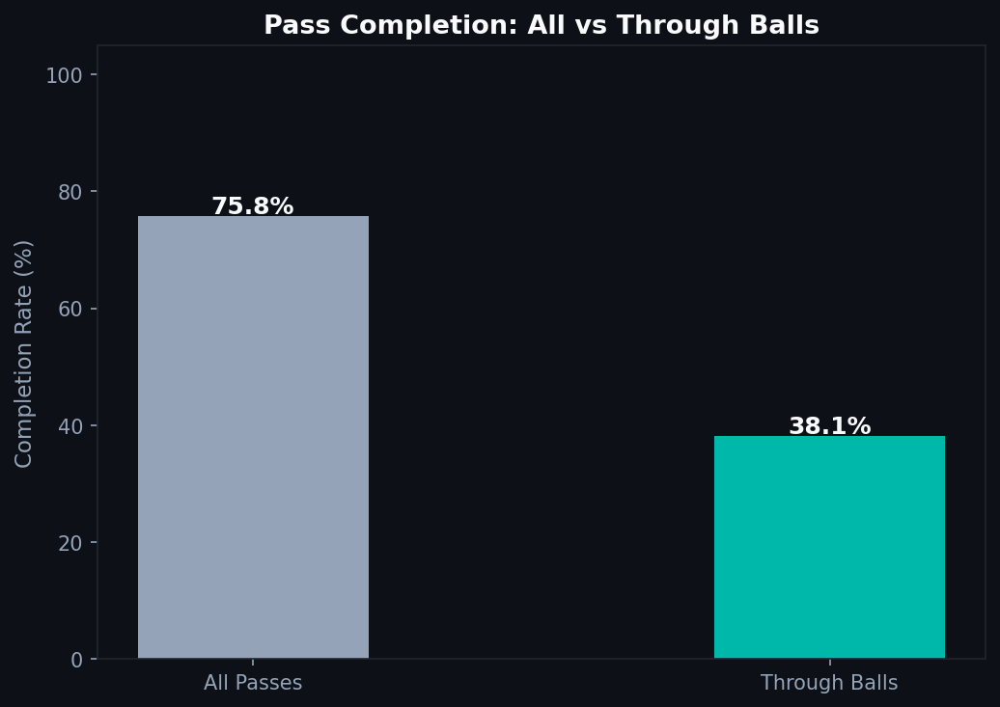
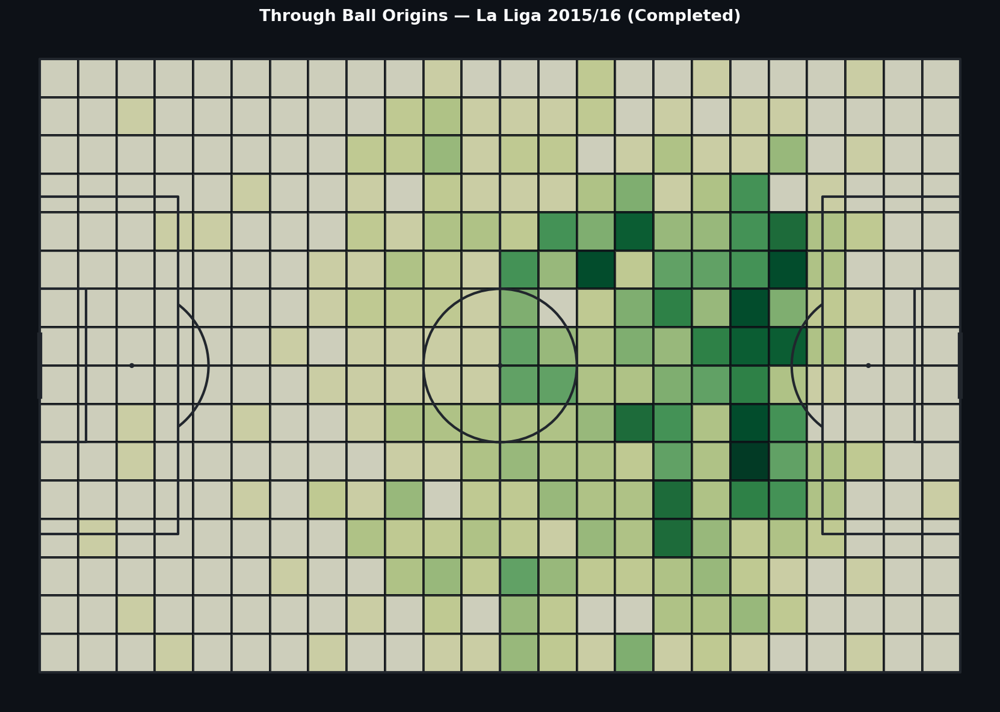
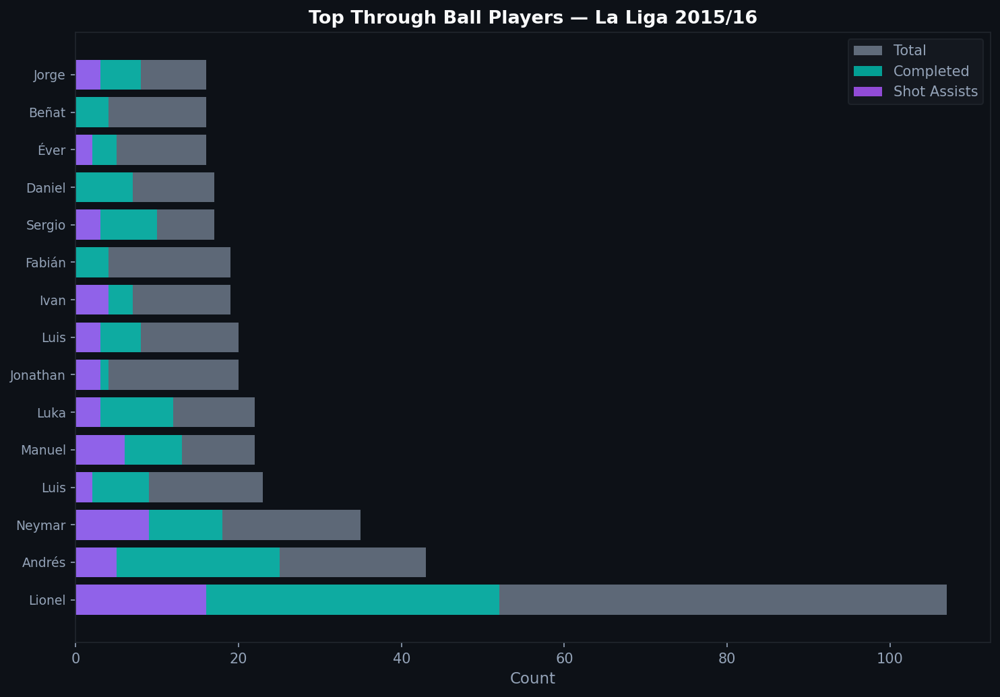

# 2.3 — Through Balls: The Riskiest Pass in Football

A through ball splits a defensive line and puts an attacker through on goal in one action. The completion rate is far below any other pass type. But when it works, nothing is more dangerous.

---

## What Statsbomb Records

Each pass has a `pass_technique` field. A through ball gets the value `Through Ball` — distinct from a regular forward pass, it specifically describes a ball played into space behind the defensive line to release a runner.

The dataset also records whether the pass was completed, whether it led to a shot, and whether it led to a goal.

---

## Completion Rates: The Inherent Risk



Across La Liga 2015/16, the overall pass completion rate is around 80%. Through balls complete at roughly half that rate.

This is not a failure of execution. A through ball is designed to be played into space that the defense is actively closing. The risk is structural — baked into the pass type itself. The question is whether the reward justifies it.

---

## Where They Come From



Completed through balls cluster in the central midfield and attacking third. The pattern makes sense: a through ball needs a receiver running behind the line, which requires being close enough to the penalty area that the ball can reach the attacker before defenders recover.

Through balls from deep positions are rare and rarely completed.

---

## Who Plays Them



The players with the most completed through balls in La Liga 2015/16 are predominantly playmakers and central midfielders. Messi, operating as a false nine in this period, appears near the top. His ability to find pockets of space and thread passes through compact defenses made through balls a signature of his game.

The chart stacks total through balls, completions, and shot assists.

---

## Code

```python
def is_through_ball(technique):
    if isinstance(technique, dict):
        return technique.get('name', '') == 'Through Ball'
    return False

passes_df['is_through'] = passes_df['pass_technique'].apply(is_through_ball)
through_balls = passes_df[passes_df['is_through']].copy()
through_balls['is_complete'] = through_balls['pass_outcome'].isna()
```

Full notebook available in the [GitHub repository](https://github.com/TwinAnalytics/football-analytics-blog)

*Data: Statsbomb Open Data — La Liga 2015/16, 380 matches.*

---

**Series 2 — Tactical Analysis**

[← 2.2 Pressing](../2-2-ppda/) · [2.4 Freeze Frames →](../2-4-freeze-frames/)
