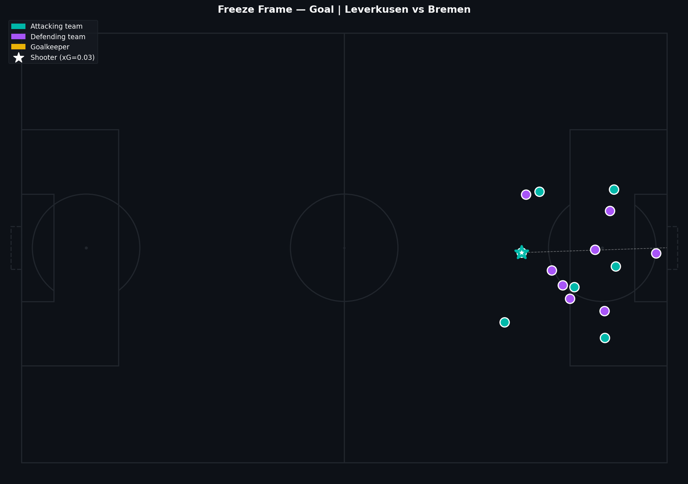
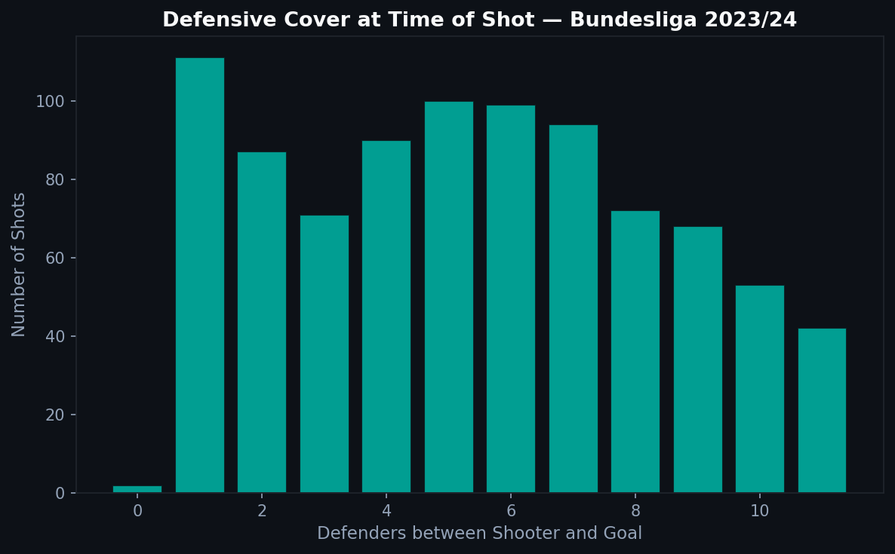

# 2.4 — Freeze Frames: Who Stands Where at the Moment of the Shot?

For every shot in the Statsbomb 360° data, there is a snapshot of every tracked player's position at the exact moment the ball is struck. That snapshot is the freeze frame. It is the hidden layer beneath the basic shot data.

---

## What a Freeze Frame Contains

Each 360° freeze frame is a list of player objects. Every player has:
- A location (x, y coordinates)
- A flag indicating whether they are a teammate of the shooter
- A position label (including goalkeeper)

It does not capture every player on the pitch — the visible_area polygon defines what the tracking cameras could see. Players outside that zone are not in the frame.

---

## A Single Shot Visualized



The teal dots are the attacking team. Purple are defenders. Yellow is the goalkeeper. The star is the shooter, with a dashed line to the center of goal.

What this view makes immediately clear is something the basic shot data cannot show: whether the shot was blocked by a defender between the ball and the goal, whether the goalkeeper was positioned well or badly, and how much space existed around the shooter.

The xG model accounts for position and technique, but not for the goalkeeper's exact location. A freeze frame shows you exactly what the model cannot see.

---

## How Many Defenders Are Blocking the Lane?



Across all 360° shots in Bundesliga 2023/24, most shots have zero or one defender between the shooter and the goal. The tail of the distribution represents blocked or heavily contested situations — these are shots where even excellent placement would likely be stopped.

This distribution has practical implications. It tells you that when a shot is blocked, it was genuinely an unusual situation (high defensive coverage), and when it goes through cleanly, the shooter had a real window.

---

## Reading the Data

```python
with open(f'three-sixty/{match_id}.json') as f:
    frames = json.load(f)

frames_dict = {fr['event_uuid']: fr for fr in frames}

# Match to event
for _, shot in shots.iterrows():
    eid = shot.get('event_id')
    if eid not in frames_dict:
        continue
    freeze = frames_dict[eid].get('freeze_frame', [])
    for player in freeze:
        location = player['location']
        is_teammate = player['teammate']
```

The key is matching `event_id` from the events DataFrame to `event_uuid` in the freeze frame file. Not every event has a corresponding frame — only events that fell within the camera's visible area are included.

---

## Why This Matters

Freeze frames transform shot analysis from "where was the shot from" to "what was the situation at the moment of the shot." Combined with xG, they let you evaluate whether a shot that went in was actually a good decision, or whether it required the goalkeeper to be poorly positioned.

For more on 360° data in context, see [2.6 — 360° Data](../2-6-360/).

---

Full notebook available in the [GitHub repository](https://github.com/TwinAnalytics/football-analytics-blog)

*Data: Statsbomb Open Data — Bundesliga 2023/24, 34 matches with 360° tracking.*

---

**Series 2 — Tactical Analysis**

[← 2.3 Through Balls](../2-3-through-balls/) · [2.5 Carries →](../2-5-carries/)
