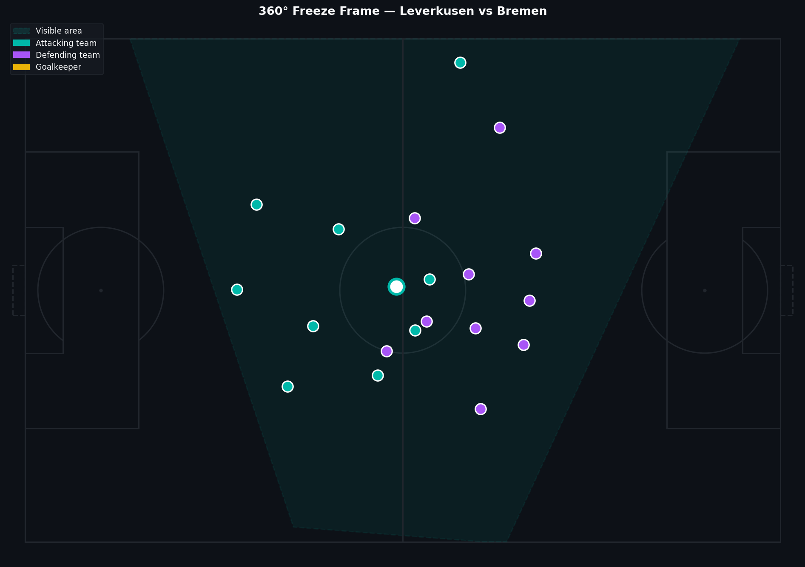
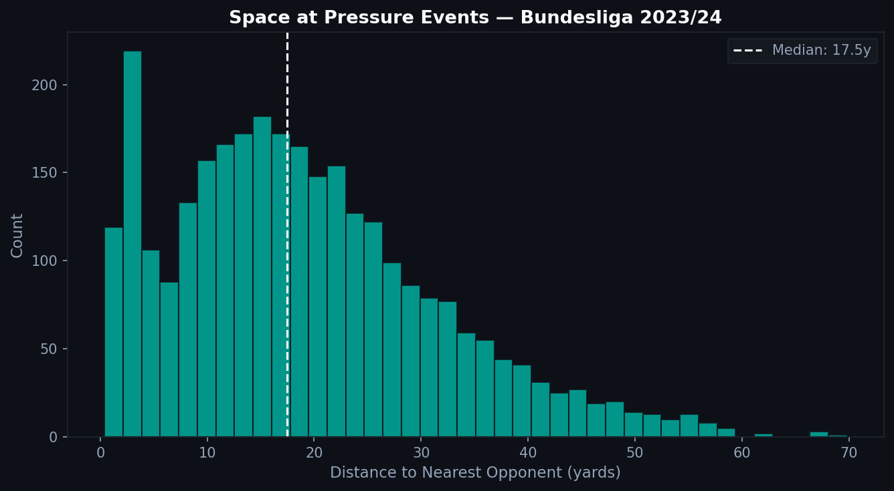

# 2.6 — 360° Data: The Next Level of Football Analysis

Classic event data tells you what happened. A pass was made. A shot was taken. A tackle was won. But it does not tell you who else was on the pitch and where. 360° data adds that layer — and it changes how much you can understand from a single moment in a match.

---

## What 360° Data Is

Statsbomb 360° data is collected for specific competitions: UEFA Euro 2020 and 2024, Women's World Cup 2023, Bundesliga 2023/24, and a handful of others. For these matches, every tracked event includes a freeze frame — a snapshot of player positions at that instant.

The data has two key components:

**Freeze frame:** A list of player locations, with flags indicating whether they are a teammate of the player who performed the event.

**Visible area:** A polygon describing which part of the pitch was within the camera's field of view. Players outside this polygon are not tracked — they simply are not in the data.

---

## Visualizing a Frame



The teal shaded polygon is the visible area — the region covered by the tracking cameras. Teal dots are attacking players. Purple are defenders. Yellow is the goalkeeper. The central dot is the player who performed the event.

The visible area constraint is important to understand. You are not seeing the full pitch. Players in dark zones outside the polygon were not captured. Analysis that assumes complete coverage will reach wrong conclusions.

---

## Pressing in 360° Space

One of the most immediate applications is measuring space under pressure. When a player receives a pressure event in the event data, the corresponding freeze frame shows how close the nearest opponents actually were.



The distribution of opponent distances at the moment of pressure events reveals the typical range at which teams commit to pressing. A tight distribution around 2-3 yards means most presses are close and committed. A wider distribution means some presses are disorganized or starting from far away.

This is information that no basic event data can provide.

---

## Reading the Data

```python
import json

# Load 360° frames for a match
with open(f'three-sixty/{match_id}.json') as f:
    frames = json.load(f)

# Match frame to event by UUID
frames_dict = {fr['event_uuid']: fr for fr in frames}

for _, event in df.iterrows():
    eid = event.get('event_id')
    if eid not in frames_dict:
        continue

    frame = frames_dict[eid]
    freeze = frame.get('freeze_frame', [])
    visible_area = frame.get('visible_area', [])
    # visible_area is a flat list [x0, y0, x1, y1, ...]
```

The matching key is `event_id` from the events DataFrame against `event_uuid` in the 360° file. Note that not every event has a frame — only those within the visible area are included.

---

## What You Can and Cannot Do

**You can:**
- Measure defensive distances and pressing intensity
- Identify how many defenders are between the ball and goal
- Visualize the spatial context of key moments

**You cannot:**
- Track players over time (frames are snapshots, not trajectories)
- See players outside the visible area
- Reconstruct the full tactical shape from a single frame

360° data is a complement to event data, not a replacement. The two together give you a much fuller picture than either alone.

For full positional tracking data — player positions at 25 frames per second across the entire pitch — you would need proprietary provider feeds, which are not publicly available.

---

Full notebook available in the [GitHub repository](https://github.com/TwinAnalytics/football-analytics-blog)

*Data: Statsbomb Open Data — Bundesliga 2023/24, 34 matches with 360° tracking.*

---

**Series 2 — Tactical Analysis**

[← 2.5 Carries](../2-5-carries/) · [P.1 GPS Introduction →](../../serie-3/p1-gps-intro/)
