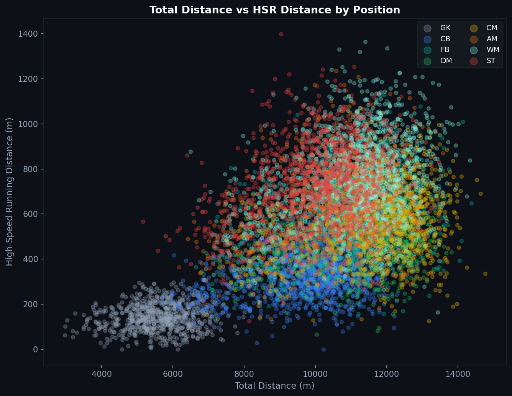
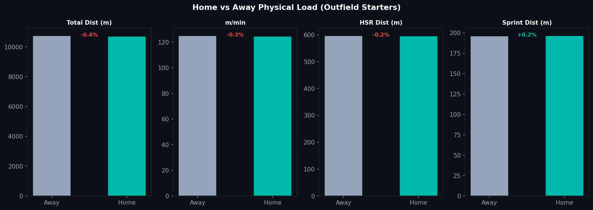
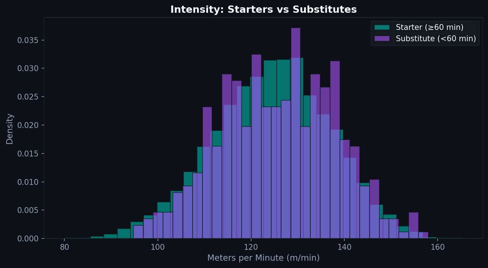

# P.3 — Distance Covered: More Is Not Always Better

The player who runs the most kilometers in a match is rarely the most valuable player in the match. Total distance is the most visible physical metric, but it is also the most misleading when used without context.

---

## Total Distance vs. High-Speed Running

The fundamental problem with total distance: it treats a slow jog the same as a sprint. A player who covers 11 km mostly at walking pace has covered more distance than a winger who covered 9 km but spent a third of it at sprint speed.

The scatter shows a clear separation by position. Goalkeepers cluster at low total distance and near-zero HSR. Central defenders have high total distance but modest HSR. Wingers and forwards show the opposite pattern: their total distance is driven substantially by high-intensity work.

The position-specific clusters are the point. A defender with winger-level HSR numbers might be leaving their zone too often. A winger with defender-level HSR numbers might not be making the runs their team needs.

---

## Home vs. Away

One of the consistent findings in sports science literature is that teams tend to work harder away from home, specifically in the early minutes of matches, when away teams often press harder to establish themselves.

Across the synthetic dataset, outfield starters show slightly higher intensity metrics in away matches. The differences are small but directionally consistent with published literature (Lago et al. 2010).

This has practical implications for conditioning. Away fixtures may carry slightly higher physical loads, which should factor into recovery planning.

---

## Starters vs. Substitutes: Why m/min Is the Right Metric

Total distance comparisons between starters and substitutes are meaningless: a starter who plays 90 minutes will always cover more ground than a substitute who plays 15 minutes.

Meters per minute (m/min) normalizes for playing time. It makes the intensity comparison fair.

Substitutes show a higher m/min distribution than starters. This is consistent and expected: substitutes enter the game fresh and play at higher intensity for shorter periods. When managers use tactical substitutions, they are often specifically looking for that intensity boost.

A starter's m/min will drop across the course of a match. A substitute's m/min is measured during their peak output window.

---

## What Total Distance Is Actually Useful For

Total distance is a meaningful metric for:

- **Comparing the same player across matches**: a significant drop in total distance often indicates fatigue or injury
- **Team-level comparisons across similar tactical setups**
- **Tracking seasonal trends**: a player's distance gradually declining over a long season is a real signal

What it does not tell you: whether the player was doing the right things at the right times. A central midfielder who covers 14 km by pressing everything and leaving gaps is more of a problem than a midfielder who covers 10 km with precise positioning.

---

*Data: Synthetic GPS dataset. Parameters derived from Mohr et al. (2003), Bradley et al. (2009), and Di Salvo et al. (2007). Values are illustrative and should not be cited as empirical measurements.*

Full notebook available in the [GitHub repository](https://github.com/TwinAnalytics/football-analytics-blog)

---

**Series 3 — Physical Performance**

[← P.2 Sprint Profiles](../p2-sprints/) · [P.4 Accelerations →](../p4-accelerations/)
