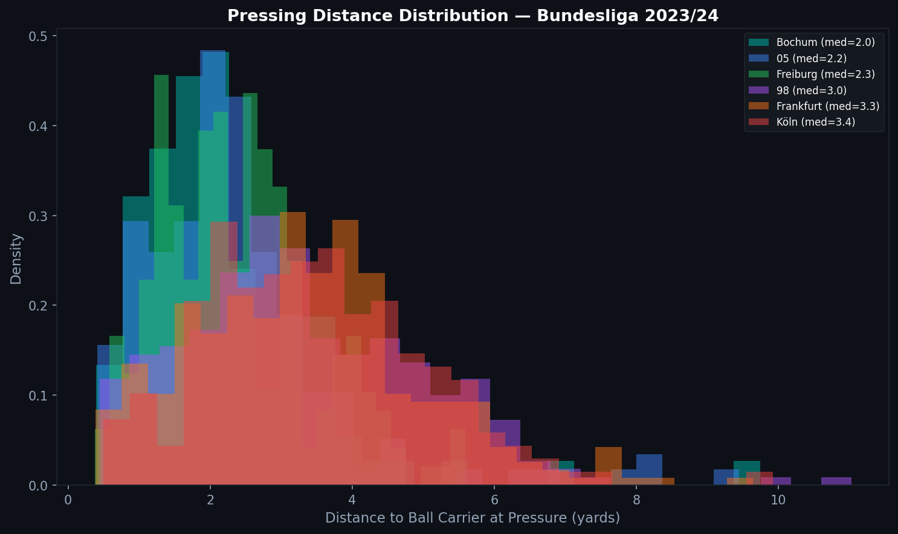
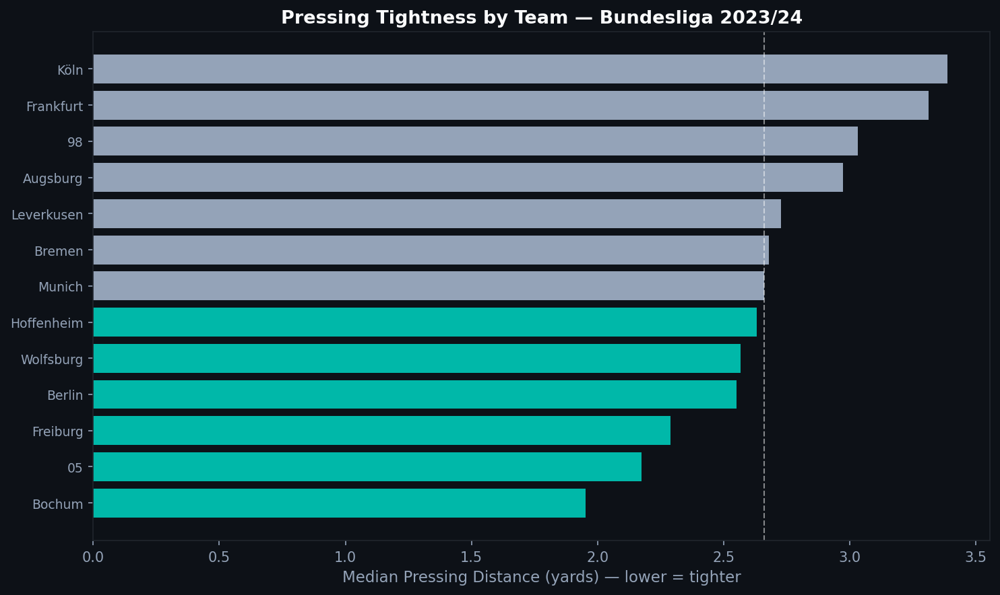

# P.5 — Pressing Space from 360° Data

GPS data tells you how far a player ran. 360° freeze frames tell you how close they were to the ball at a specific instant. Combined, these two data sources answer a question that neither can answer alone: not just how much a team presses, but how tightly they press.

---

## Two Datasets, One Question

The preceding articles in this series used synthetic GPS data to describe physical outputs — distance, speed, accelerations. This article uses real Statsbomb 360° data from Bundesliga 2023/24 to quantify the spatial dimension of pressing.

The core question: **when a player executes a pressing action, how close is the nearest opponent to the ball carrier?**

A low distance means intense, close pressing. A higher distance means the player committed to press from further away — which may mean a poorly-timed press, or a pre-planned high-line trap.

---

## Reading the Frames

Each pressure event in the Statsbomb data has a corresponding 360° frame. The frame contains the positions of all tracked players at the moment of the event.

```python
for _, pev in pressure_events.iterrows():
    eid = pev.get('event_id')
    if eid not in frames_dict:
        continue

    frame = frames_dict[eid]
    freeze = frame.get('freeze_frame', [])
    px, py = pev.get('x', 0), pev.get('y', 0)

    # Nearest opponent distance
    opponents = [p for p in freeze if not p.get('teammate', True)]
    min_dist = min(
        np.sqrt((p['location'][0]-px)**2 + (p['location'][1]-py)**2)
        for p in opponents
    )
```

The result is a distance in yards for every tracked pressure event.

---

## Pressing Distance Distribution



The distribution shows the range of pressing distances across teams. Teams with density concentrated at lower distances are committing to tight presses close to the ball carrier. Teams with distributions spread toward higher distances are pressing from further away.

---

## Team Ranking by Pressing Tightness



The median pressing distance by team creates a directional ranking of pressing intensity. Teams on the left press tighter. Teams on the right press looser — whether by design or because their pressing actions are less synchronized.

This is different from PPDA (covered in 2.2), which counts pressing frequency. A team could press very often but loosely (high PPDA, high median distance). A team that presses rarely but in well-organized traps would have low median distance despite moderate PPDA.

Both dimensions matter. The 360° data provides the one that conventional event data cannot.

---

## The Connection to Physical Data

The physical metrics from P.2 through P.4 describe what a player can do — their speed profile, their distance capacity, their acceleration load. The 360° pressing data describes what a team does with those capabilities.

A team with high-acceleration fullbacks and wingers can execute tight, close-distance presses without leaving gaps, because they can close distances quickly and recover their shape rapidly. A team without that physical quality has to press from further away, committing to a press before they are in position.

This is the bridge between physical performance analysis and tactical analysis — and why both fields need each other to answer the questions that matter.

---

*Statsbomb data: Bundesliga 2023/24, 34 matches with 360° tracking.*

Full notebook available in the [GitHub repository](https://github.com/TwinAnalytics/football-analytics-blog)

---

**Series 3 — Physical Performance**

[← P.4 Accelerations](../p4-accelerations/) · [4.1 Messi Career →](../../serie-4/4-1-messi/)
