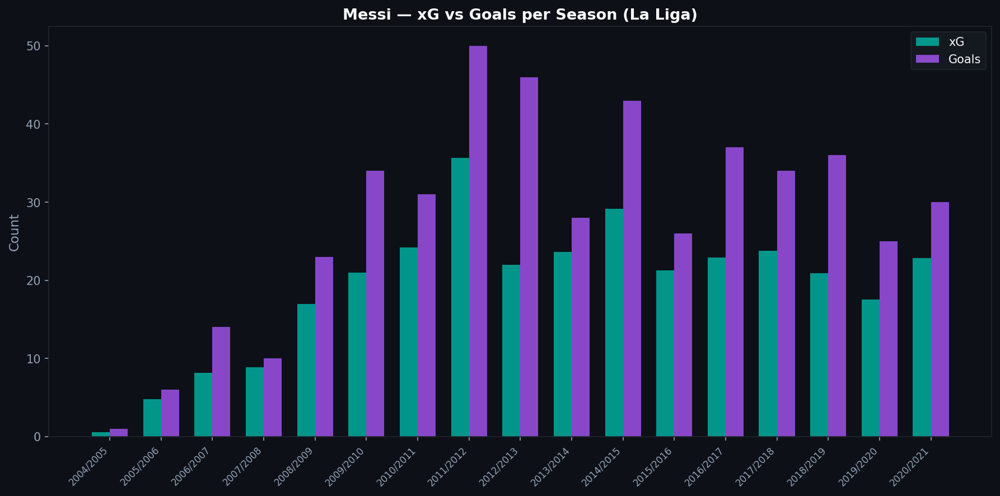
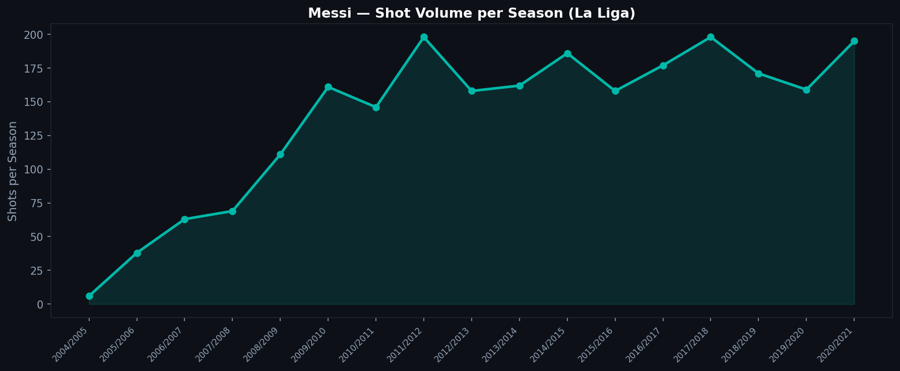
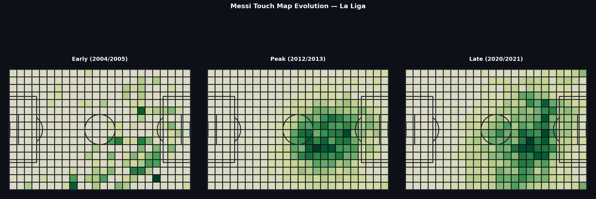

# 4.1 — Messi in La Liga: 15 Years in Numbers

Lionel Messi played 17 seasons for FC Barcelona. The Statsbomb Open Data covers the La Liga portions from 2004/05 to 2020/21, enough to track his development from teenage winger to false nine to ageing playmaker through the lens of data.

The thesis is simple: Messi's playing style changed fundamentally over his career, and the data makes that change visible.

---

## Goals and xG Across Seasons



The teal bars show Messi's cumulative xG per season: the quality of chances he created. The purple bars show his actual goals.

Two observations stand out. First, Messi consistently overperformed his xG during his peak years (2009–2015). The gap between bars is finishing quality: he converted chances at a higher rate than the model's baseline would predict.

Second, in his later seasons, the xG and goals bars converge. Either his finishing came closer to expected levels, or the nature of his chances changed: taking on shots the model rates highly rather than improvising in positions the model rates poorly.

---

## Shot Volume



Shot volume peaked around 2011/12 and 2014/15, then declined. This tracks a real shift in Messi's role. Early in his career he was a goal-scorer who dribbled into shooting positions. By 2018/19 and beyond, he was more often the architect of attacks than the finisher, taking fewer shots, setting up more, operating deeper.

The data does not tell you why this happened. Age, tactical adjustments, or both. But it makes the shift observable.

---

## Touch Map: Where He Was on the Pitch



The three heat maps show where Messi received the ball in an early season, his peak-era season, and a later season.

The early map shows concentration on the right wing, his original position as an inverted winger who cut inside. The peak-era map shows a broader distribution, covering the right side, center, and deep positions as his false-nine role emerged. The late-career map shows even more central positioning and deeper starting points, consistent with his evolution into a creator operating from withdrawn zones.

This is where data analysis earns its keep: it shows a career arc that writers and coaches have described in words, but here you can see it in the pitch coordinates.

---

## The Question of Finishing Quality

One of the persistent debates about Messi is whether he was a great finisher or whether the situations he created were simply so good that the goals came naturally. The xG data gives one answer: in his peak years, he finished well above model expectation. That is consistent with elite finishing skill, not just shot selection.

But xG models have limits. Messi often shot from angles or in situations that no model could accurately assess: one-on-one with goalkeepers, curled finishes to the far corner, situations that look simple but are not. The model underrates these shots, which inflates his apparent overperformance.

The truth is probably both: exceptional shot selection and exceptional finishing.

---

## Technical Note

Loading 14 seasons of La Liga data requires iterating over all available competition-season combinations and filtering for Messi by name:

```python
for season_row in la_liga_seasons.itertuples():
    matches = load_matches(season_row.competition_id, season_row.season_id)
    for match_id in matches['match_id']:
        raw = load_events(match_id)
        df = flatten_events(raw)
        messi_df = df[df['player'].str.contains('Messi', na=False)]
```

The name filter catches all spelling variants across seasons.

---

*Data: Statsbomb Open Data, La Liga 2004/05 to 2020/21, all available seasons.*

Full notebook available in the [GitHub repository](https://github.com/TwinAnalytics/football-analytics-blog)

---

**Series 4 — Deep Dives**

[← P.5 Pressing Space](../../serie-3/p5-pressing-space/) · [4.2 Barcelona 2015/16 →](../4-2-barcelona-1516/)
