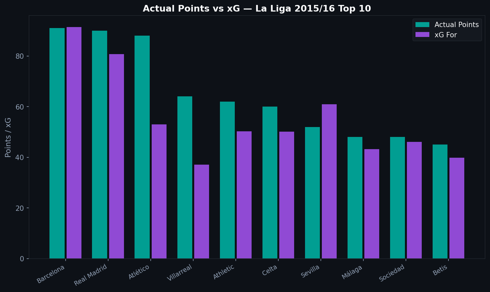
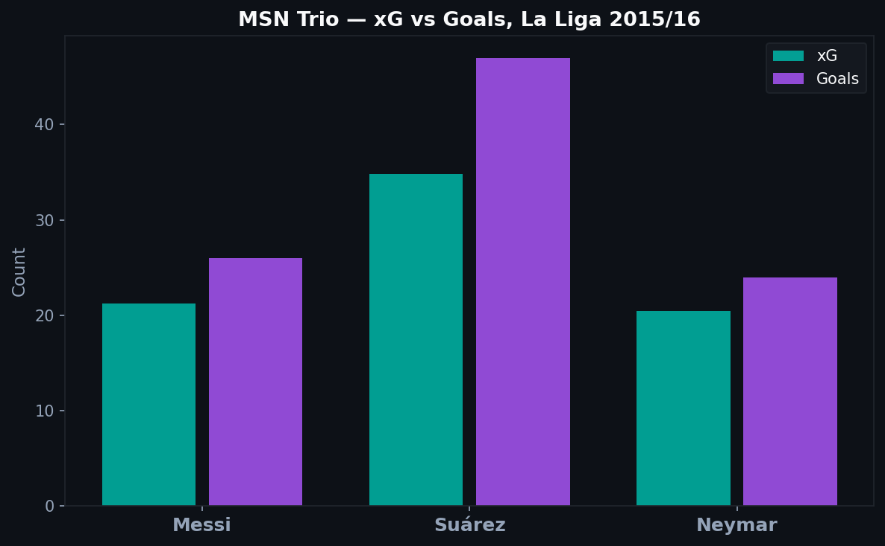
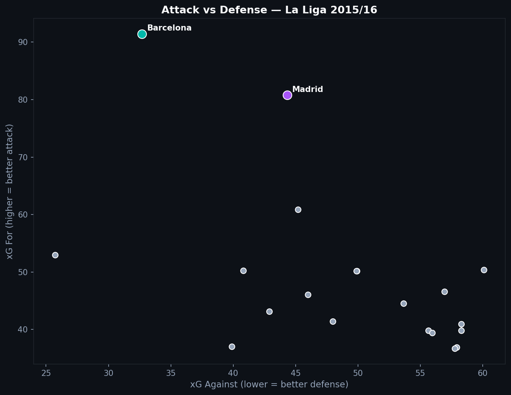

# 4.2 — The Best League Season Ever? Barcelona 2015/16 in Data

In the 2015/16 La Liga season, Barcelona scored 112 goals and won the title with 91 points. Messi, Suárez, and Neymar (the MSN trio) combined for 131 goals across all competitions. By every surface statistic, it was one of the most dominant single-season performances in football history.

But what do the underlying numbers say? Were they truly that much better than the rest, or did results flatter them?

---

## The xG Table vs. the Actual Table

The most revealing comparison: how the league table looks when you replace actual goals with expected goals.

Barcelona's actual points lead is even more pronounced in xG terms. Their xG across 380 matches was the highest in the league by a significant margin, meaning they did not just score a lot, they created a lot of high-quality chances. The goals followed logically from the chances.

Real Madrid also sit clearly above the rest in xG, with Atletico Madrid competitive in defense (low xG against) but less dominant in attack. The bottom of the table tells a familiar story: teams with low xG both for and against tend to finish in mid-table.

---

## The MSN Trio

Messi, Suárez, and Neymar each had distinct profiles:

**Messi** led in xG: he was in the best positions, taking the highest-quality shots. His actual goals closely matched his xG, suggesting he was performing at the level his chances predicted.

**Suárez** dramatically outperformed his xG. He was a more prolific goal scorer than his expected output suggested. This is consistent with his reputation as an elite finisher, converting chances that the model rated as difficult.

**Neymar** accumulated significant xG across many shots, converting at roughly expected levels. His role involved creating for others as much as finishing himself.

---

## Attack vs. Defense: The League Scatter

The x-axis is xG against (lower = better defense). The y-axis is xG for (higher = better attack). Top right means dominant on both ends. Bottom left means poor on both.

Barcelona sits in an extreme position: very high xG for, very low xG against. No other team in the 2015/16 league came close in both dimensions simultaneously. Real Madrid were nearly as dangerous in attack but more permissive defensively. Atletico sat in the opposite quadrant: elite defense, moderate attack.

The rest of the league clusters in the middle, neither particularly strong nor particularly weak in either dimension.

---

## Was It the Best Season Ever?

The data supports the case. Barcelona's xG numbers in 2015/16 are the highest in the La Liga dataset. Their goal tally (112) was not the product of luck or weak opposition. It reflected sustained creation of high-quality chances across 38 matches.

What the data cannot settle: whether 2015/16 Barcelona was better than Arsenal's 2003/04 invincibles, or Bayern Munich's 2012/13 treble team. The Statsbomb dataset does not include those seasons, and even if it did, xG models calibrated on different eras produce numbers that resist direct comparison.

What the data does say: within La Liga history as covered by Statsbomb, the 2015/16 Barcelona attack was in a category of its own.

---

*Data: Statsbomb Open Data, La Liga 2015/16, 380 matches, all 20 teams.*

Full notebook available in the [GitHub repository](https://github.com/TwinAnalytics/football-analytics-blog)

---

**Series 4 — Deep Dives**

[← 4.1 Messi Career](../4-1-messi/) · [4.3 Women's World Cup →](../4-3-wwc/)
