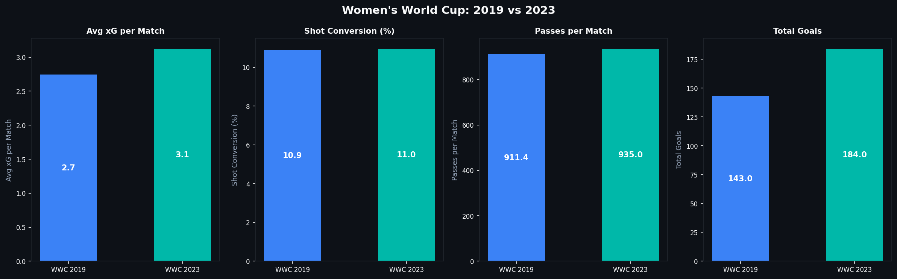
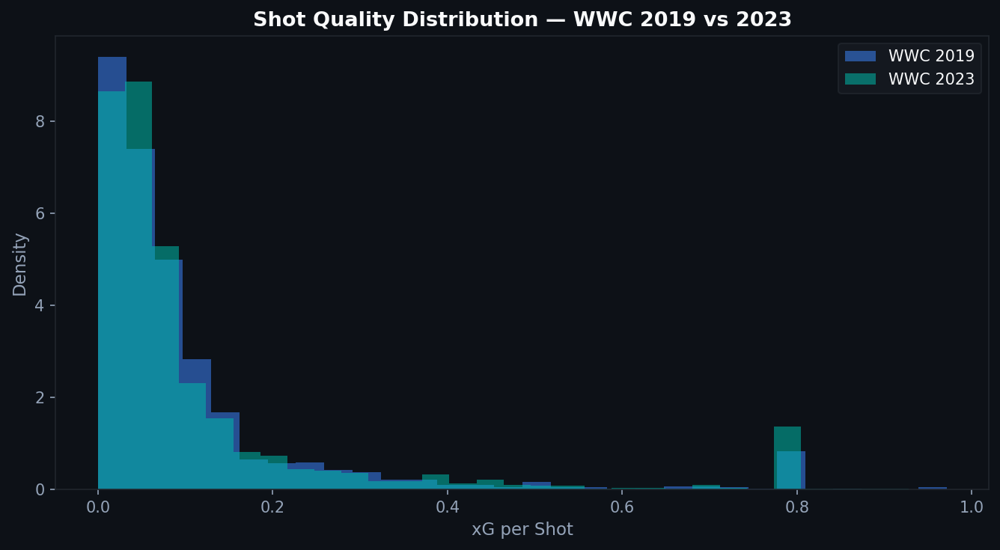

# 4.3 — Women's World Cup: 2019 vs. 2023 in Data

Four years separate two Women's World Cups. The sport grew in that time: more investment, more professional leagues, more players who spent their entire careers in serious competitive environments. But did that growth show up in the data?

---

## The Thesis

The 2023 Women's World Cup should show measurable signs of tactical and technical development compared to 2019: higher passing tempo, more intense pressing, better chance creation.

The Statsbomb data covers both tournaments completely: 52 matches in 2019, 64 in 2023 (with 360° data available for 2023). This gives us the ability to actually test the thesis.

---

## Side-by-Side Comparison

Four key metrics:

**Average xG per match:** 2023 shows higher xG, meaning better-quality chances were created on average. This could reflect improved attack quality, worse defensive organization, or simply more attacking play.

**Shot conversion rate:** 2023 conversion rate was slightly lower despite better xG per match. More high-quality chances were created but converted at a marginally lower rate.

**Passes per match:** The 2023 tournament featured more passes per match, consistent with higher tempo and more structured play.

**Total goals:** 2023 had significantly more total goals (2.77 per match vs. 2.24 in 2019). Higher xG + more shots explains a meaningful portion of this.

---

## Shot Quality Distribution

The xG distribution for individual shots shows the most interesting finding. In 2023, there are more shots at both ends of the distribution: more very low-xG speculative shots, and more high-xG close-range opportunities.

This suggests more open, end-to-end play in 2023. Teams were creating better chances but also conceding more of them. The game opened up.

In 2019, the distribution was more compressed, with fewer very-high-xG opportunities, suggesting more organized defenses. The famous USWNT performance in 2019 was built partly on defensive structure that limited opponent chance quality.

---

## Caveats

Cross-tournament comparisons with xG models carry a structural limitation. The Statsbomb model is calibrated on a broad dataset, not tournament-specific. Systematic differences between WWC and club football (different pitch sizes, tactical cultures, refereeing standards) affect xG calibration in ways that are hard to quantify.

The 360° data available for 2023 also enables richer analysis than was possible for 2019. Some of the apparent differences may reflect measurement quality rather than actual game differences.

That said, the directional findings are consistent with what observers have reported qualitatively: the 2023 tournament was faster, more open, and produced more goals.

---

## 2023's Unique Feature: 360° Data

Because 2023 has freeze frame data, analysis that is not possible for 2019 becomes available: defensive distances at the moment of shots, spatial context for key events, goalkeeper positioning.

This asymmetry will only grow. As Statsbomb collects more 360° data for future tournaments, historical comparisons will be hampered by the fact that older data lacks this dimension. The implication: archive what you can analyze now, because the data layer for older events cannot be reconstructed retroactively.

---

*Data: Statsbomb Open Data, Women's World Cup 2019 (52 matches) and 2023 (64 matches, including 360° tracking).*

Full notebook available in the [GitHub repository](https://github.com/TwinAnalytics/football-analytics-blog)

---

**Series 4 — Deep Dives**

[← 4.2 Barcelona 2015/16](../4-2-barcelona-1516/) · [4.4 Champions League Finals →](../4-4-cl-finals/)
