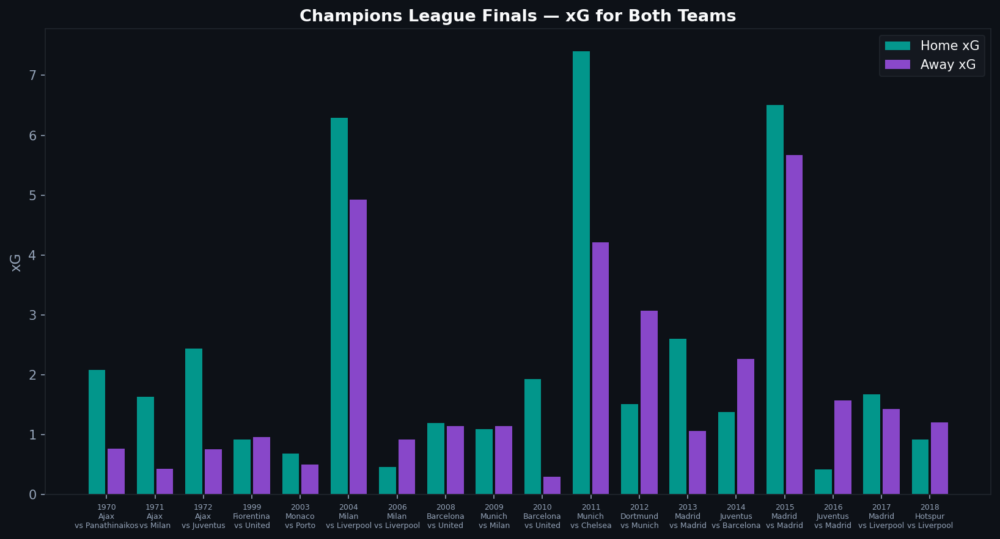
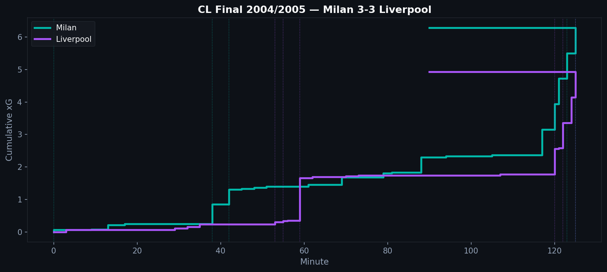
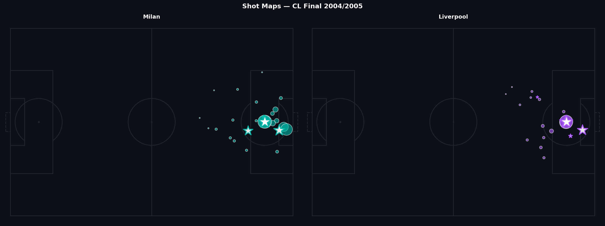

# 4.4 — Champions League Finals: When Data Meets History

The Statsbomb dataset includes 18 Champions League finals, stretching from 2003/04 to 2018/19. These are some of the most-watched and most-analyzed matches in football history. The data gives us a way to look at them that the television broadcast could not.

---

## The Dataset

Each Champions League season in the Statsbomb Open Data represents the final match of that campaign. The coverage includes:

- 2003/04 through 2018/19 (not every season, depending on availability)
- Full event data: shots, passes, carries, pressures
- Match outcomes (score, extra time, penalties where applicable)

This is a small sample by statistical standards — 18 matches — but it is 18 of the most scrutinized matches in football. Even limited data on them is valuable.

---

## xG Across All Finals

The chart shows home (first-listed) and away xG for each final. A few patterns emerge:

Some finals were extremely one-sided in xG terms — one team dominated chance creation but may not have converted. Others show close xG totals despite lopsided final scores, suggesting fortune played a role.

The aggregate average xG per match across finals is broadly similar to league football. Contrary to the narrative that finals are uniquely cautious affairs, the data suggests chance creation at roughly comparable levels to regular high-stakes matches.

---

## The Most Dramatic Final: Cumulative xG

For the final with the most combined goals in the dataset, the cumulative xG chart reveals the match's internal logic:

The cumulative lines show when each team created their best moments. Dotted vertical lines mark actual goals. When a team's actual goals come far ahead of their cumulative xG line, they were converting at above-expectation rates. When goals lag behind the xG curve, chances were being wasted.

This view answers a question the scoreline cannot: was the result surprising given the chances, or did it reflect the balance of play?

---

## Shot Maps

The side-by-side shot maps show each team's shots from the shooter's perspective (normalized so attacks go right). Star markers are goals. Larger circles indicate higher xG shots.

The spatial distribution reveals different attacking strategies. One team may have concentrated shots centrally and from close range. Another may have attempted more from outside the penalty area — either because they could not penetrate, or because their style favored long-range attempts.

---

## Why Finals Are Hard to Analyze

Champions League finals suffer from extreme small-sample problems. With one match per season, even 18 seasons provide limited statistical power.

They are also outlier events in terms of preparation and context. Teams spend weeks specifically preparing for one opponent. Tactical setups are highly game-planned. This means you cannot easily generalize findings from finals to other matches.

What the data is good for with finals: describing exactly what happened, and placing it in the quantitative context of the chances created. Whether Barcelona really dominated Liverpool in 2018/19 (xG suggests yes), whether Real Madrid were lucky against Juventus in 2016/17 (the data offers some evidence either way).

The stories we tell about these matches deserve to be tested against evidence, even incomplete evidence.

---

*Data: Statsbomb Open Data — Champions League finals, multiple seasons.*

Full notebook available in the [GitHub repository](https://github.com/TwinAnalytics/football-analytics-blog)

---

**Series 4 — Deep Dives**

[← 4.3 Women's World Cup](../4-3-wwc/) · [4.5 Leverkusen 2023/24 →](../4-5-leverkusen/)
