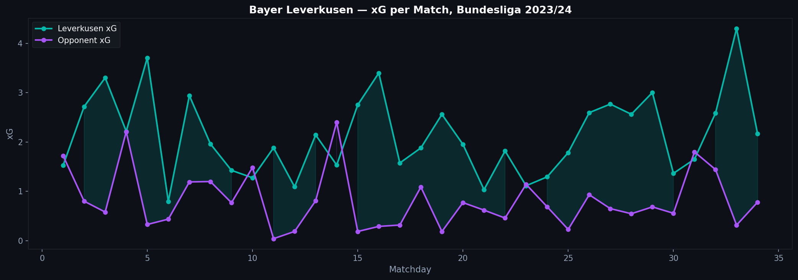
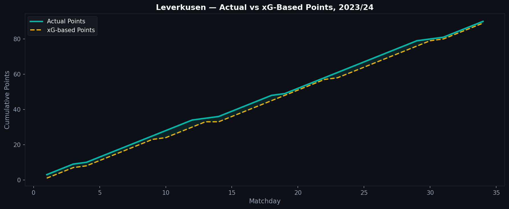
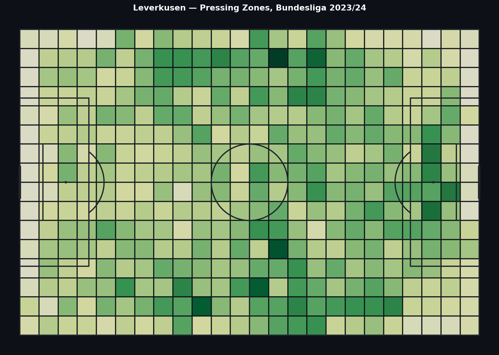

# 4.5 — Bayer Leverkusen 2023/24: The Unbeaten Season in Data

Bayer Leverkusen finished the 2023/24 Bundesliga season unbeaten. 28 wins, 6 draws, 0 defeats across 34 matches. The last team to go unbeaten in a major European league was Arsenal in 2003/04. Was Leverkusen's achievement built on genuine dominance, or did fortune play an unusual role?

---

## xG Per Match: Dominance and Close Calls

Across the 34 Bundesliga matches, the chart shows Leverkusen's xG (teal) against their opponents' xG (purple) match by match. The shaded areas highlight when they outperformed or were outperformed in chance creation.

The headline finding: Leverkusen were not dominant in every match. There were games where the opponent created more or comparable chances. The unbeaten record was not simply a function of never being threatened — it was sustained through some matches where they needed late goals or opponent misses.

This is consistent with the media narrative about Leverkusen's "never say die" quality: a remarkable number of late equalizers and winners. The xG chart shows exactly where those moments occurred.

---

## Actual Points vs. xG-Based Points

To estimate how many points Leverkusen would have earned purely based on xG outcomes (win if xG > opponent xG + 0.3, draw if within 0.3), we can compare that projection to actual points accumulated.

The gap between the lines shows where results deviated from chance creation. Leverkusen's actual points consistently ran ahead of their xG-based estimate — meaning they got more results than their underlying dominance would strictly predict.

This is the statistical fingerprint of the "Xabi Alonso magic" that journalists wrote about — a team that outperformed its xG profile through finishing, psychological resilience, and a specific ability to score in the final minutes of close matches.

---

## Pressing Zones

The pressing heatmap shows where Leverkusen executed pressure events across their home and away matches. The density concentrates in the opponent's half, particularly the central and wide channels ahead of the defensive third.

Leverkusen pressed high and with structure. Their press was not random — it was organized to funnel opponents into specific zones where ball recovery was most likely. The heatmap makes the spatial concentration visible.

---

## The Late Goal Phenomenon

One aspect of Leverkusen's season that the xG data captures indirectly: several of their draws turned into wins, or potential losses turned into draws, through goals in the 90th minute and beyond.

When a team consistently converts late opportunities that a basic xG model rates as unlikely, there are two explanations: exceptional luck, or something specific about their physical and mental preparation that the model cannot see.

The acceleration data from P.4 of this series is relevant here. Teams that maintain physical output in the final 10 minutes — high acceleration counts, sprint capacity preserved — are more likely to create and convert late chances. Leverkusen's physical profile in 2023/24 was reportedly elite at late-game intensity.

We cannot verify this directly from the Statsbomb dataset alone, but the combination of xG overperformance and documented late goals is consistent with a team that maintained physical and tactical quality when others faded.

---

## Was It Luck or Greatness?

The data does not give a clean answer because the question contains a false dichotomy.

Leverkusen consistently outperformed their xG. That overperformance, sustained across 34 matches, is unlikely to be pure luck. A team that overperforms its xG once is probably lucky. A team that does it repeatedly across a full season is probably doing something the model cannot measure — better late-game fitness, finishing quality, tactical adjustments at key moments.

At the same time, the xG data shows they were not invulnerable. Several matches where the opponent had higher xG ended in Leverkusen draws or narrow wins. Without some good fortune — a save here, a near-miss there — the unbeaten run might have ended earlier.

The honest answer: a combination of elite coaching, physical preparation, and some statistical fortune that is inseparable from a full season of close matches.

---

*Data: Statsbomb Open Data — Bundesliga 2023/24, 34 matches including 360° tracking.*

Full notebook available in the [GitHub repository](https://github.com/TwinAnalytics/football-analytics-blog)

---

**Series 4 — Deep Dives**

[← 4.4 Champions League Finals](../4-4-cl-finals/)
